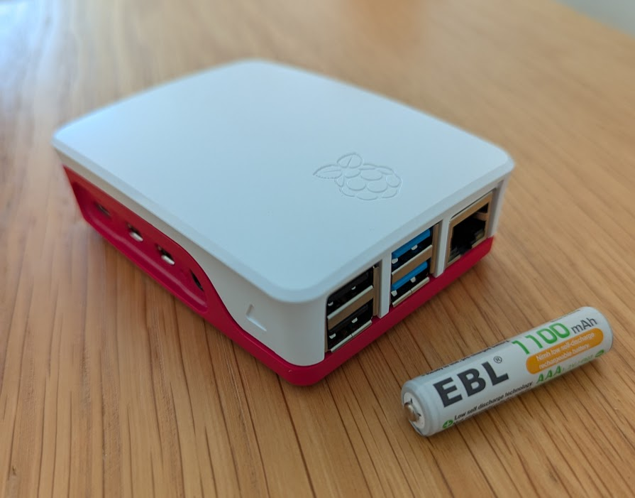
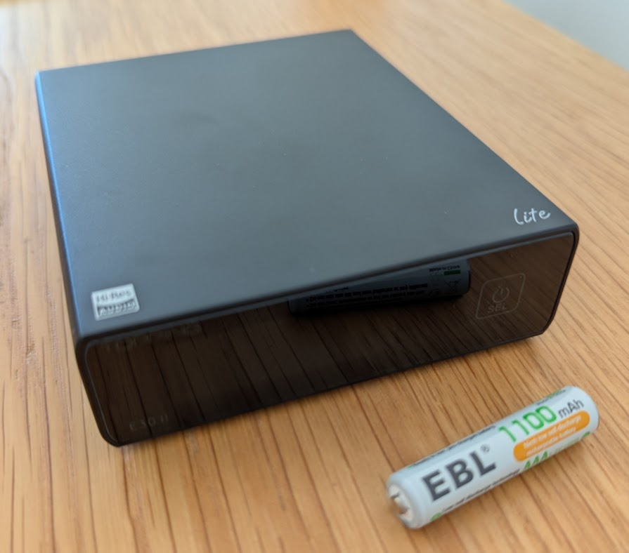
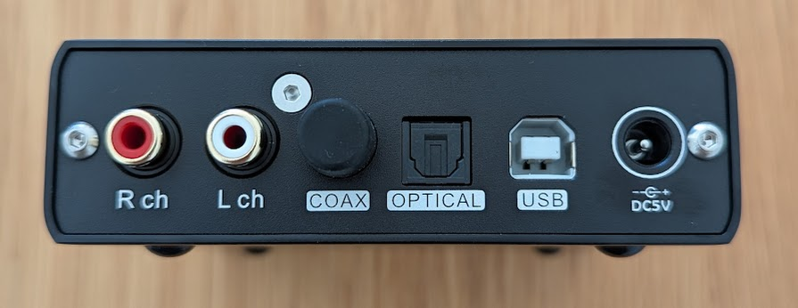
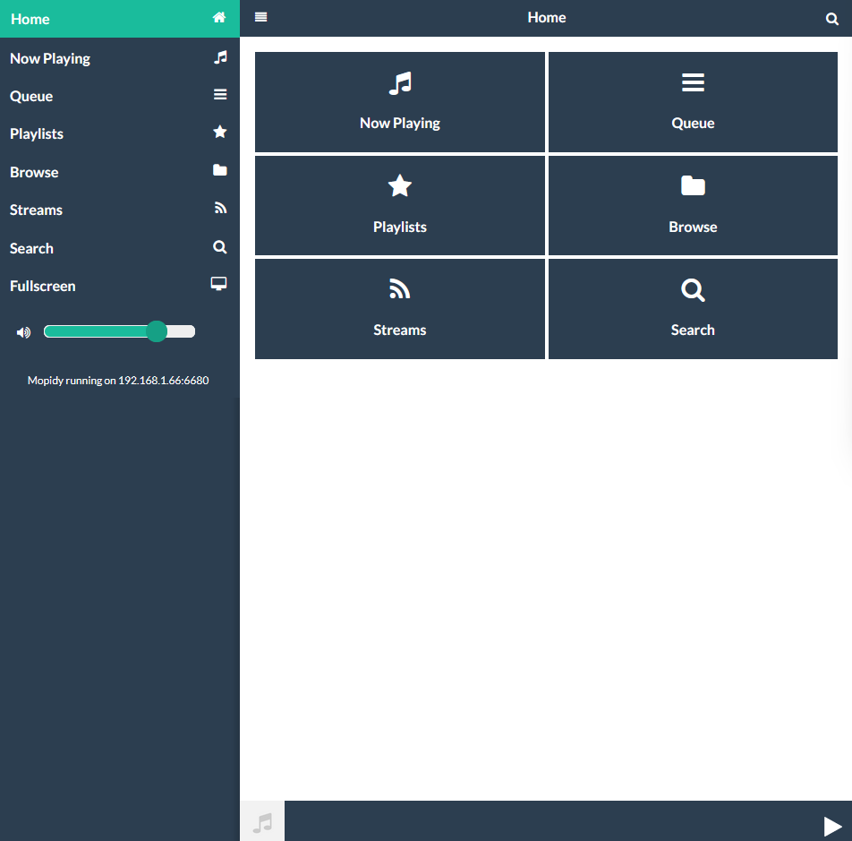
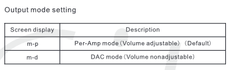
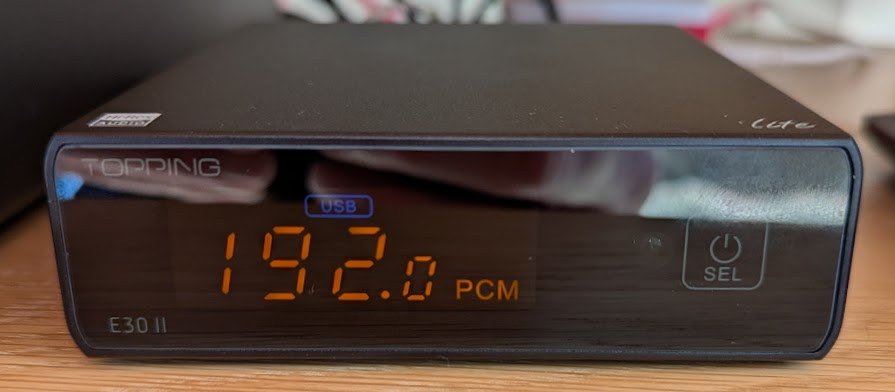

## Overview {#sec-overview}

I've had a Sonos set-up since 2014 with the S1 controller and it's got increasingly flaky. My old [Naim Nait 3](https://en.wikipedia.org/wiki/Naim_NAIT) amplifier and [Royd Minstrel](https://www.roydaudio.org/models/minstrel-2/) speakers are still going strong. Rather than upgrading with Sonos, I decided start by replacing the Sonos Connect as this is the hi-fidelity part of the system.

My listening habits are music from Spotify and music from BBC Radio 3 and sport on BBC Radio 5.

After much messing around (@sec-issues) I settled on a [Raspberry Pi](https://en.wikipedia.org/wiki/Raspberry_Pi) running [Mopidy](https://mopidy.com/) connected to an external DAC (Digital to Audio Convertor) that is connected to my Naim Nait 3. And I switched from Spotify to [Tidal](https://tidal.com/) to take advantage of the higher quality audio streaming from Tidal. Transferring all my music was seamless with [TuneMyMusic](https://www.tunemymusic.com/).

Cost-wise, at the time of writing this was £173.40 and comparable all-in-one streamer DACs are the WiiM Pro Plus is £219 or a Bluesound Node Performance for £499.

Modipy Music Server and associated extensions are free.

Tidal is the same price as Spotify Premiun, but has surprised me with how much better it sounds combined with the DAC than Spotify. I signed up for a free 30 day trial of Tidal, but it was a no-brainer to quit Spotify once I did a listening comparison between the services. Even on the other old Sonos components I can hear more clarity with Tidal. TuneMyMusic was £4.35.

It's not perfect, as:

1.  I now have two systems rather than one multi-room system: the remaining two parts of the Sonos are still working, but they can be controlled with Bubble UPnP if the Sonos software fails altogether, or I can create a multi-room system with Modipy if I want to replace the Sonos units.

2.  Radio is a bit tricky and I can't just stream BBC Sounds, which is integrated into Sonos. That is a bit annoying, but even with that limitation the quality of the live radio streams sounds much better. Radio 3 sounds amazing by comparison to the Sonos Connect.

Here's a summary of what I did, lessons learnt etc.

## Components {#sec-components}

Prices correct at the time of writing.

### Raspberry Pi {#sec-pi}

I got everything from the [PiHut](https://thepihut.com/), you may be able to find things cheaper, such as SD cards or cases, but it was convenient to buy it all together.

-   Raspberry Pi 4 Model B x 1 4GB : £52.50
-   Raspberry Pi 15W USB-C Power Supply - UK Plug x 1 White : £7.50
-   Raspberry Pi Micro SD Card with RPi OS Pre-Installed x 1 32GB : £9.60
-   Raspberry Pi 4 Case x 1 Red & White : £4.80

Subtotal : £74.40

{#fig-rpi fig-alt="Raspberry Pi 4 B in its case with AAA battery for scale" width="400"}

### DAC {#sec-dac}

I spent a bit of chatting with Claude and then reading blogs about DACs and eventually settled on the [Topping E30II lite](https://www.toppingaudio.com/product-item/e30-ii-lite). Given the age of my amplifier and speakers it didn't seem worth getting something more expensive and the DAC chip itself AK4493S was well reviewed on the blogs I browsed.

-   Topping E30II lite DAC : £99 from Amazon (no power supply included)

Total: £173.40

{#fig-e30-front fig-alt="Topping E30II Lite DAC with AAA battery for scale" width="400"}

It only comes with a USB cable for the power, but I had an old 5V 2A DC power supply I could use. I wasn't sure the Pi was powerful enough to power it via USB.

{#fig-E30-back fig-alt="Back of the Topping E30II Lite showing the USB connection to the Raspberry Pi and R ch and L ch to my amplifier and the 5V DC power socket " width="400"}

## Additional costs

[TuneMyMusic](https://www.tunemymusic.com/) cost £4.35 to transfer and back-up service for all my Spotify playlists, tracks, albums etc. The back-ups are csv files I downloaded.

## Configuring the Raspberry Pi and Mopidy {#sec-config-pi}

I use Linux for work and whilst I'm not an expert, I'm comfortable with using the command line/terminal and SSH (secure shell) for setting things up.

First I put the SD card in my Windows laptop (it has a slot) and used the [Raspberry Pi Imager](https://www.raspberrypi.com/software/) to configure the login and network settings for the Raspberry Pi operating system the SD card.

Then I put the SD card into the Raspberry Pi and when booted it up I could login into the Pi from my Windows laptop using [Git Bash](https://git-scm.com/downloads) and [SSH](https://www.atlassian.com/git/tutorials/git-ssh) and do everything else.

At this point I connected the Topping DAC to the Pi via the USB, and plugged in the Ethernet to the Pi and the power to both devices.

On first boot and login I checked for and installed any updates before installing [Mopidy](https://mopidy.com/)

I mostly followed the [Mopidy documentation](https://docs.mopidy.com/stable/installation/) for setting up the server with the bundled extensions.

To use Mopidy from a web browser I needed a web client, I ended up using [MusicBox Web Client](https://mopidy.com/ext/musicbox-webclient/) extension (@fig-musicbox) and for accessing my Tidal account I needed the [Mopidy Tidal](https://mopidy.com/ext/tidal/) extension.

To install these I found I needed to use the `--break-system-packages` flag. Normally I wouldn't do this as it might create problems as the flag says, but I don't plan to use the Pi for anything else so in this case I went ahead.

`sudo python3 -m pip install Mopidy-Tidal --break-system-packages`

Configuration is done using the `mopidy.conf` file in `/etc/mopidy/mopidy.conf`.

To configure the settings for the DAC, I first used `aplay -l` to list the audio devices attached to the Pi and the DAC was on card 3, hence `device=plughw:3,0`

My configuration file looks like this:

```{.bash}
# Run `sudo mopidyctl config` to see the current effective config, based on
# both defaults and this configuration file.
[http]
enabled = true
hostname = 0.0.0.0
port = 6680
default_app = musicbox_webclient

[audio]
output = alsasink device=plughw:3,0
buffer_time = 500000
mixer = software
mixer_volume = 100

[tidal]
quality = HI_RES_LOSSLESS

[stream]
enabled = true
protocols =
  http
  https
  hls
  m3u8
```

If I wanted to stream files from a USB drive, I could add this to.

To play music I then access Mopidy via the [MusicBox Web](https://mopidy.com/ext/musicbox-webclient/) web client extension I installed from my laptop or phone at: `http://<MY-ROUTER-ADDRESS>:6680/musicbox_webclient/index.html`

It's simple, but does what I need (@fig-musicbox).

{#fig-musicbox fig-alt="Screenshot of MusicBox web client that I use to play music via Mopidy" width="400"}

### Radio {#sec-config-radio}

Radio is added through Streams (@fig-musicbox). This [Gist list](https://gist.github.com/bpsib/67089b959e4fa898af69fea59ad74bc3) of BBC Radio streams is what I used. I only really listen to four stations, so these are what I added and configured to maximum bitrate:

```{.bash}
# BBC Radio 3
https://lstn.lv/bbcradio.m3u8?station=bbc_radio_three&bitrate=320000
# BBC Radio 5 Live
https://lstn.lv/bbcradio.m3u8?station=bbc_radio_five_live&bitrate=320000
# BBC Radio 5 Sports Extra
http://as-hls-uk-live.akamaized.net/pool_47700285/live/uk/bbc_radio_five_live_sports_extra/bbc_radio_five_live_sports_extra.isml/bbc_radio_five_live_sports_extra-audio%3d320000.norewind.m3u8
# BBC Radio 4
https://lstn.lv/bbcradio.m3u8?station=bbc_radio_fourfm&bitrate=320000
```

The main issue is that there are rights issues with live sport and so these events aren't streamed, which is annoying, but I don't really need hi-fi for sport. Be great if there was BBC Sounds integration, then I could stream podcasts and back catalogue programmes.

### Tidal connect {#sec-config-tidal}

To connect the Mopidy Tidal extension, you first need to set-up your Tidal account. Then you connect it to the Mopidy extension in much the way you link devices to other services i.e. by using a web browser and a link to link.tidal.com and typing in a pass code that registers the device and your account with Tidal.

As illustrated in the [documentation](https://github.com/tehkillerbee/mopidy-tidal), the link with code appears in the log file.

```{}
journalctl -u mopidy | tail -10
...
Visit link.tidal.com/AAAAA to log in, the code will expire in 300 seconds.
```

## Configuring the Topping DAC {#sec-config-dac}

As well as connecting to my Naim Nait 3, the DAC needs to be in USB mode or there will be no sound!

The E30II Lite can be used either as an pre-amplifier and DAC, meaning one can control the volume. Or simply as a DAC, which is the cleanest path and the one I wanted.

On switching on it defaults to pre-amplifier mode, and to switch to DAC mode one has to:

-   first put it standby and then hold down the (only) button for 5 seconds to access the settings menu

-   cycle through by pressing the button until you see `m–p` and then double-press to change it to `m-d`,

-   then hold the button until `8-8` is displayed and it will save the settings and return to standby.

{#fig-switching-mode fig-alt="Image from the Topping E30II Lite manual about switching DAC mode"}

More information in [the Topping E30II Lite manual](https://dl.topping.audio/usermanual/e30ii_e30iil.pdf).

To check I was getting the highest quality streaming I went to Tidal and found some HiRes music, which streams lossless with 24 bit depth at 192 kHZ and checked what the DAC was decoding.

{#fig-tidal-hires fig-alt="Image of 192 kHz streaming from Tidal on Topping E30II Lite" width="400"}

## Issues {#sec-issues}

-   I ~~wasted~~ spent a non-trivial amount of time first trying to set-up Moode Audio instead of Mopidy, but I couldn't get Tidal to work.

-   Then I ~~wasted~~ spent a non-trivial amount of time trying to configure Iris web client with Mopidy, but couldn't get Tidal playlists to work or add Radio streams.

-   I didn't have audio for ages until I realised I'd not set the DAC to USB connection!
