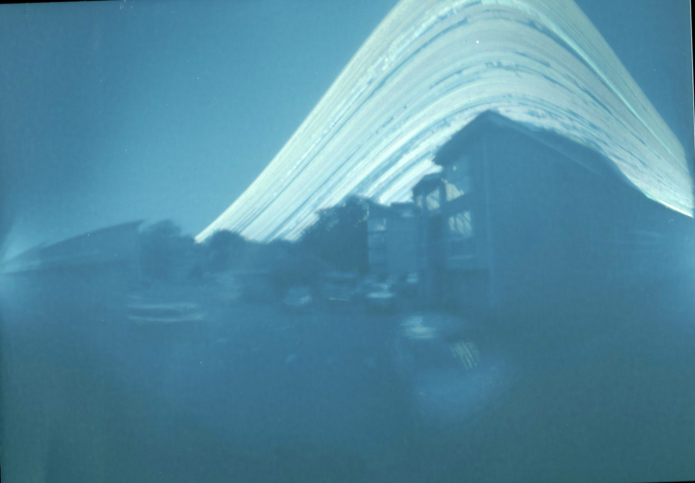
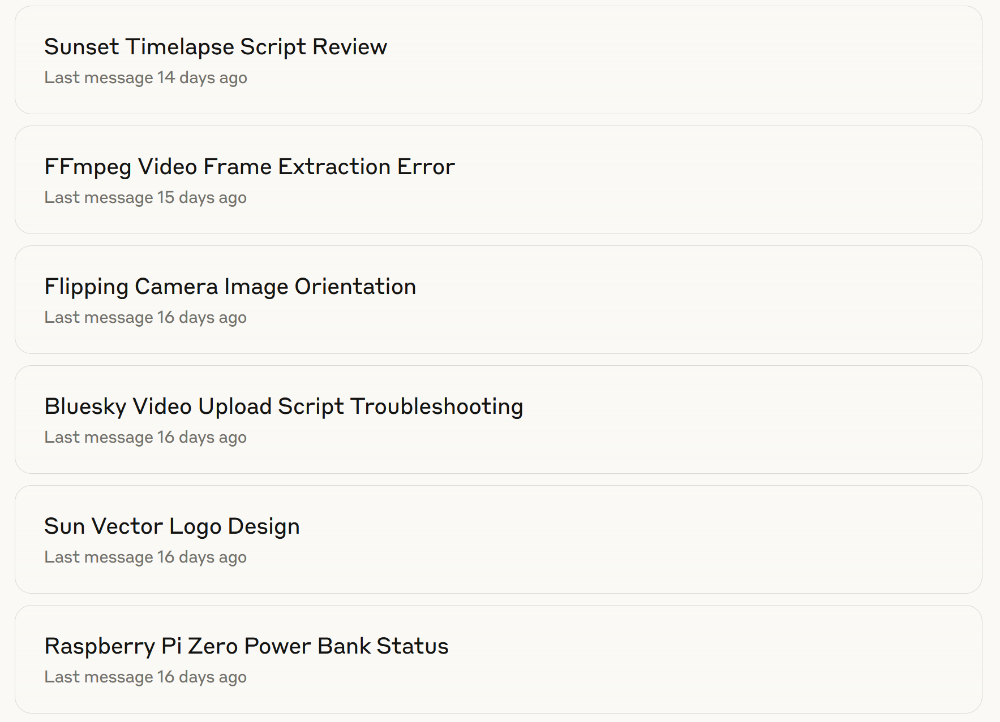

## Preamble

Previously I set-up a [pi-hole](https://pi-hole.net/) to get rid of adverts. It doesn't speed up my internet connection, but pages load about 10-20% as they aren't loading adverts. However, I used a [Raspberry Pi Zero](https://thepihut.com/products/raspberry-pi-zero-w) and it would crash regularly as it's not very powerful. So I recently replace it with Pi 4B and that's much better. But that left me with the Pi Zero and I thought I should something with it.

Also previously, after Sandra at work had introduced me to [solarigraphy](https://en.wikipedia.org/wiki/Solarigraphy), I took a few solargraphs using beer cans. The one below in @fig-01 is a year long solargraph from my balcony from November 2021 to 2022.

{#fig-01 fig-alt="Solargraph, Southampton November 2021 to November 2022. The sun traces lines across the sky in arcs that vary in height throughout the year." width="600"}

So I thought I'd do something similar, but this time using video and combining it with a bit of learning and a lot of vibe coding using [Claude](https://claude.ai) (my LLM of choice) to create a bot that posts the results to Bluesky each day here: [Bluesky Sunrise Bot](https://bsky.app/profile/southamptonsunrise.bsky.social). The Pi creates a 30 second timelapse of dawn each morning, sends a photo to [groq](https://groq.com/) which uses llama to create a haiku from the image, and then the haiku and timelapse are posted from the Pi to Bluesky. I'll probably run it from now (July 2025) until Christmas 2025 and then see whether I want to keep going or not.

If you are interested in doing something similar, I've summarised what I did here and the code is on Github at:

As you'll see, it's all hacky and inelegant, but elegant and efficient wasn't the point.

## Overview

The whole thing took much longer than I'd hoped to get it to work properly, so despite the length, this is the short version. As well as a lot of time using Claude, I watched[YouTube videos reviewing Raspberry Pi cameras](https://www.youtube.com/watch?v=-NxpCirSqm4)and reading things like this guide to building a [Nature Camera](https://mynaturewatch.net/daylight-camera-instructions) and a [Timelapse Recorder](https://learn.pimoroni.com/article/make-a-timelapse-with-octocam).

In addition to a Raspberry Pi Zero itself (I had a power supply and SD card already), I needed a camera and having watched a few reviews I decided there was not much point getting a fancy camera and bought the [Pi Zero Camera module](https://shop.pimoroni.com/products/raspberry-pi-zero-camera-module?variant=37751082058) (5 MP).

I also bought a [heatsink](https://shop.pimoroni.com/products/heatsink?variant=16851450375) having read the Nature Camera instructions. I was originally intending to place the camera outside build a housing and power the Pi with a USB power bank, and thought this would be necessary for cooling. In the end I decided it was too much trouble and have set it up indoors looking through a window and plugged into the mains. I may get some reflections, but laziness won in the end.

## Setting up the Pi Zero

Blah

## Vibe coding main script

I use Claude most days now, for work, for things like this and increasingly for (re)search. Like any tool it can be misused, but after a year of using it regularly, it's a bit like imagining life without a mobile phone or the internet. It can be done, but why would one limit oneself?

Currently I'm paying £18 a month for the Pro Plan. For this I set-up a Project, which is allows me to create a general prompt and attach documents such as code scripts or pdfs of scientific manuscripts to guide Claude's responses. For example here the project prompt is `Set-up and write code for a Raspberry Pi Zero with a camera module. Images will be sent to groq to auto generate text and then the video and text will be posted to Bluesky` and my dashboard looks like this:

{#fig-02 width="400"}

Powerful as Claude is, only fools or naifs rely on single sources of information, so resources like Marc Dotson's blog explaining the [differences between R and python](https://occasionaldivergences.com/posts/python-intro/) are super helpful. My coding knowledge is primarily R, with a bit of bash and other bits and pieces from my time doing bioinformatics and academic writing. In hindsight, I could have attempted to do this in R (maybe a project for another day) or even something more exotic, but I naturally assumed this should be done in python and I want to improve my python knowledge, so the choice was as arbitrary as that.

Over 17 days (hmm) I've had 28 "chats" in this project to completion, including a crisis of meaning after 12 days where I nearly abandoned it, left it for a few days and then decided to finish it. All the joy of a PhD project in 17 days.

@fig-03 shows some of the chats, so you can see I was doing things like trying to figure out how powerful a USB power bank I'd need, code reviews and even getting Claude to create a logo for my Bluesky bot account.

{#fig-03 fig-alt="Screengrab of Claude chats with titles like flipping camera image orientation and sunset timelapse script review" width="500"}

## Testing and scheduling

blah
