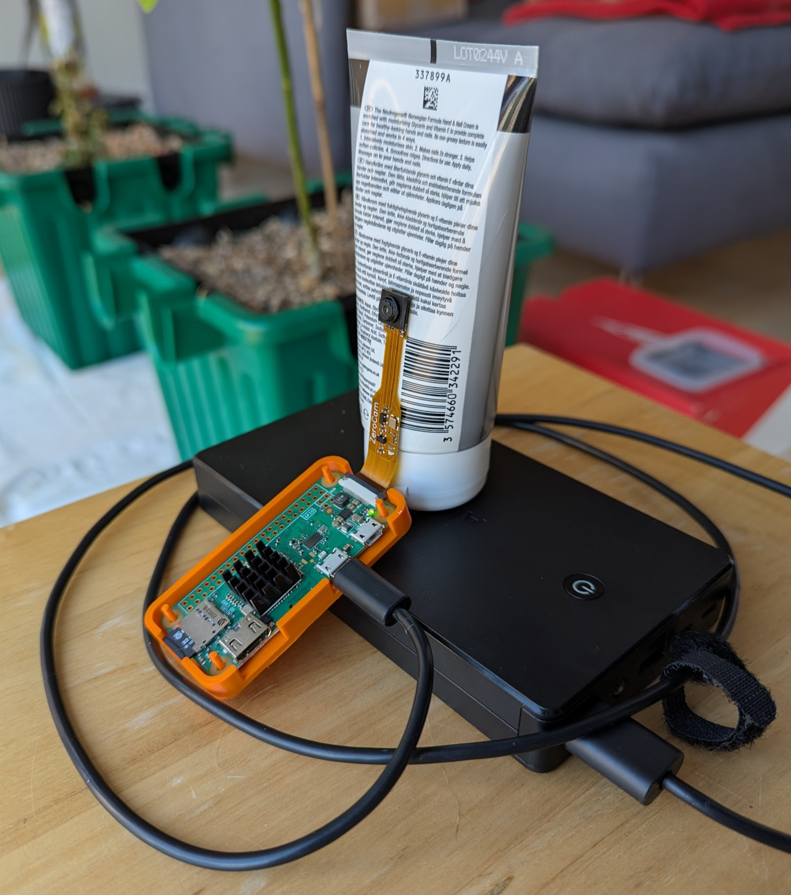
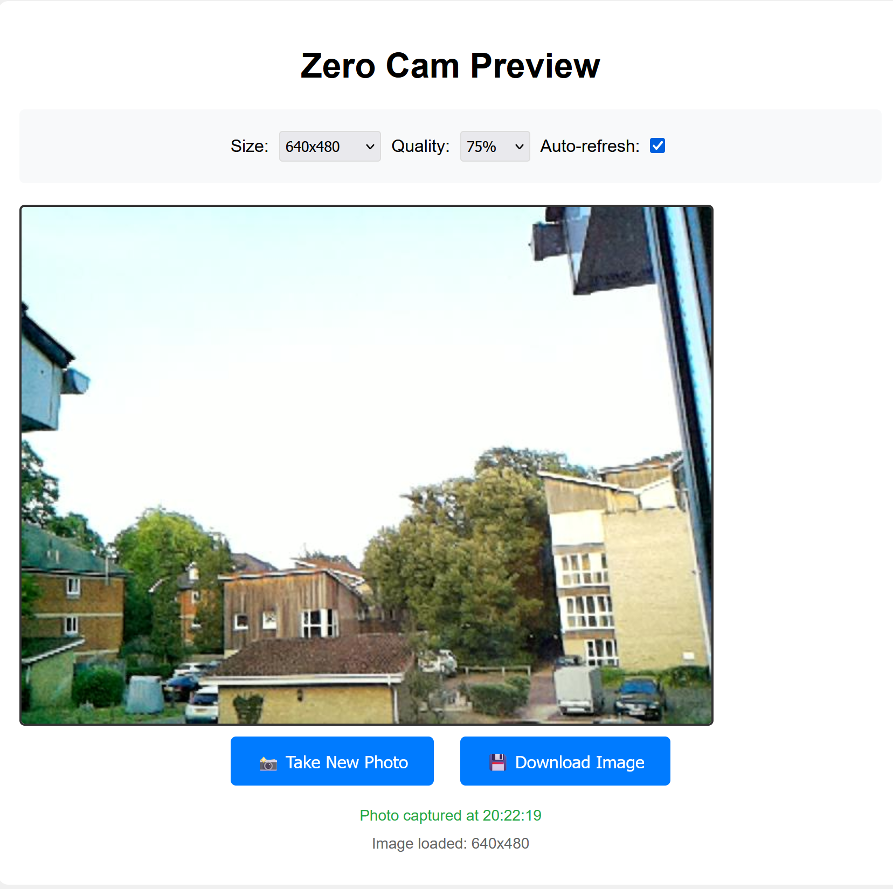
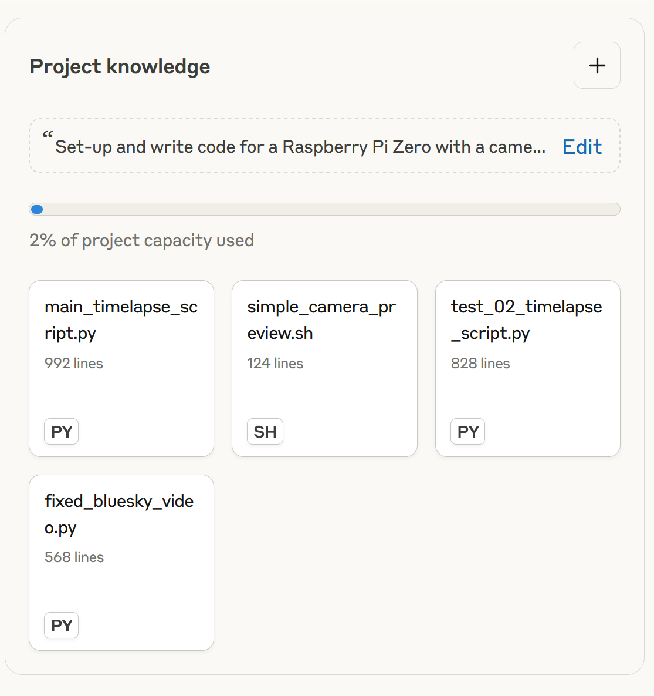

## Preamble - The Ship of Theseus {#sec-preamble}

Previously I set-up a [pi-hole](https://pi-hole.net/) to get rid of adverts. It doesn't speed up my internet connection, but pages load about 10-20% faster as they aren't loading adverts. However, I used a [Raspberry Pi Zero](https://thepihut.com/products/raspberry-pi-zero-w) and it would crash regularly as it's not very powerful. So I recently replaced it with Pi 4B and that's much better. But that left me with the Pi Zero W and I thought I should something with it.

Also previously, after Sandra at work had introduced me to [solarigraphy](https://en.wikipedia.org/wiki/Solarigraphy), I took a few solargraphs using beer cans. The one below in @fig-01 is a year long solargraph from my balcony from November 2021 to 2022.

{#fig-01 fig-alt="Solargraph, Southampton November 2021 to November 2022. The sun traces lines across the sky in arcs that vary in height throughout the year." width="800"}

So I thought I'd do something similar, but this time using video and combining it with a bit of learning and a lot of vibe coding using [Claude](https://claude.ai) (my LLM of choice) to create a bot that posts the results to Bluesky each day here: [Bluesky Sunrise Bot](https://bsky.app/profile/southamptonsunrise.bsky.social). The Pi creates a 30 second timelapse of dawn each morning, sends a photo to [groq](https://groq.com/) which uses llama to create a text description from the image and then posts the timelapse video and text from the Pi to Bluesky. I'll probably run it from now (August 2025) until Christmas 2025 and then see whether I want to keep going or not.

If you are interested in doing something similar, I've summarised what I did here and the code is on Github at: <https://github.com/ab604/pi-sunrise-timelapse>

As you'll see, it's all hacky and inelegant, but elegant and efficient wasn't the point. I was doing this as I had a left over Pi Zero, but as it turned out after much troubleshooting and sunk costs, I ended up building [The Ship of Theseus](https://en.wikipedia.org/wiki/Ship_of_Theseus). To cut a long story short, after I got the timelapse working, the Pi kept crashing and to fix it, I first replaced the power supply, then the SD, then the Pi Zero W and then I tore the ribbon installing the camera on the new Pi Zero 2 W and had to replace the camera too.

Anyhow, @fig-sunrise shows an example what I ended up with after spending far too many hours and more money than I intended on this bit of fun.

::: {#fig-sunrise}


30-second sunrise timelapse on 2025-08-05
:::

## Overview

Despite the length, this is the short version. As well as a lot of time using Claude, I watched [YouTube videos reviewing Raspberry Pi cameras](https://www.youtube.com/watch?v=-NxpCirSqm4) and reading things like this guide to building a [Nature Camera](https://mynaturewatch.net/daylight-camera-instructions) and a [Timelapse Recorder](https://learn.pimoroni.com/article/make-a-timelapse-with-octocam).

In addition to a [Raspberry Pi Zero 2 W](https://thepihut.com/products/raspberry-pi-zero-2) itself, I bought a [power supply](https://thepihut.com/products/raspberry-pi-zero-uk-power-supply) and [microSD card](https://www.amazon.co.uk/dp/B08TJTB8XS), I needed a camera and having watched a few reviews I decided there was not much point getting a fancy camera and bought the [Pi Zero Camera module](https://shop.pimoroni.com/products/raspberry-pi-zero-camera-module?variant=37751082058) (5 MP).

I also bought a [heatsink](https://shop.pimoroni.com/products/heatsink?variant=16851450375) having read the Nature Camera instructions. I was originally intending to place the camera outside build a housing and power the Pi with a USB power bank, and thought this would be necessary for cooling. In the end I decided it was too much trouble and have set it up indoors looking through a window and plugged into the mains. I may get some reflections, but laziness won in the end.

Total cost at the time of writing was £52.73 not including shipping and the extra camera because I broke one.

@fig-original-pi shows the original faulty Pi Zero and Zero Cam with the heat sink.

What follows assumes you do know a bit about Unix based computer systems, coding, and messing about with large language models like Claude. But I've tried to provide enough breadcrumbs for anyone curious who doesn't know about that stuff.

## Setting up the Pi Zero

I have a Windows 11 laptop with a microSD card slot, so I used the [Raspberry Pi imager](https://www.raspberrypi.com/software/) to install the Raspberry Pi OS Lite operating system: `6.12.25+rpt-rpi-v6 #1 Raspbian 1:6.12.25-1+rpt1 (2025-04-30) armv6l` . This version is without the Desktop environment and I configured the wireless network settings and login details during the imager configuration before writing the SD card. This means that I could connect to the Pi from my laptop wirelessly using a [Git BASH](https://gitforwindows.org/) terminal as soon as I put the SD card into the Pi and booted it for the first time.

::: callout-note
## Terminals, Shells, Git etc.

If you are reading this and wondering what a Git BASH terminal and why one would want to use it and *are* interested in knowing more, here are some good places to start:

-   [Data Science at the Command Line by Jeroen Janssens](https://jeroenjanssens.com/dsatcl/chapter-1-introduction#what-is-the-command-line)

-   [Software Carpentry - The Unix Shell](https://swcarpentry.github.io/shell-novice/index.html)
:::

{#fig-original-pi fig-alt="The original Pi Zero W and Zero Cam powered by USB battery pack supported by some hand cream" width="500"}

### Setting up passwordless login using a secure shell {#sec-ssh}

First login used the username and password I had set-up when configuring the imager, but I next configured login using a secure shell key so I don't need a password. This is something I've done pre-LLMs, but I got Claude to walk me through it again.

``` bash
# On my Windows machine in Git Bash, which creates a public key as file id_ed25519.pub in C:\Users\username\.ssh
ssh-keygen -t ed25519
```

Then I created a `.ssh` folder on my Pi and copied it the contents of the `id_ed25519.pub` file to a text file called `authorized_keys`

``` bash
# On my Raspberry Pi
# Create a .ssh folder
mkdir .ssh
# Copy and paste in quotes my public ssh key that I created on my Window laptop to a text file called authorized_keys
echo "pasted-contents-of-my-public-key" > .ssh/authorized_keys
```

Now I can login just using:

``` bash
ssh username@hostname.local
```

where `username` and `hostname` were configured in the imager. For example, if my username was `snips` and I called my Pi hostname `moonset` then my login command would be `ssh snips@moonset.local`. When you login for the first time with ssh, it will ask you to accept the key from the Pi on the your device in return and then you are set.

The other reason for doing this other than not wanting to type in the password whenever I login, is that I can use the command `scp` to securely copy files back and forth from my laptop to the Pi without needing a password either.

### Updating the system and configuring the python environment {#sec-python}

Having already developed the main script on the broken Pi Zero, I already knew what packages I needed to set-up the system: the `python` language and `ffmpeg` for recording the video.

I can't remember where I read about using [uv](https://docs.astral.sh/uv/) as the python package and environment manager, but as a python novice I've not really got my head round avoiding trouble with managing python dependencies and something I read suggested `uv` was a good solution.

So I asked Claude to create a little bash script called `setup.sh` that I copied over with `scp` and ran with `bash setup.sh` to install the system packages, uv, create an environment and then install the python packages I need for the main timelapse python script.

``` bash
#! /bin/bash
# Install essential system packages
echo "Updating and installing system packages..."
sudo apt update
sudo apt upgrade -y
sudo apt install --no-install-recommends -y python3-opencv ffmpeg

# Install uv
echo "Installing uv..."
curl -LsSf https://astral.sh/uv/install.sh | sh
source $HOME/.cargo/env

# Add uv to PATH for this session
export PATH="$HOME/.local/bin:$PATH"

# Create a virtual environment and install Python packages
echo "Setting up Python environment..."
uv venv venv
source venv/bin/activate

# Install Python libraries (much faster with uv)
echo "Installing Python libraries..."
uv pip install requests pillow astral atproto
```

To keep the python environment `venv` persistent so that it activates whenever I boot the Pi, I had to add a line to my bash profile `.bashrc`

``` bash
echo "source ~/venv/bin/activate" >> ~/.bashrc
```

### Testing and setting up the camera {#sec-camera}

To position the camera I needed to be able to see what is was capturing on my laptop, so I asked Claude to write a script that created a webpage that I could open on my laptop to see what the Pi was seeing and would take a new image each time I refreshed page (@fig-zerocam-preview).

The bash script is on the Github repo here: <https://github.com/ab604/pi-sunrise-timelapse/blob/main/zerocam_preview.sh>

{#fig-zerocam-preview fig-alt="Screenshot of the Zero Cam Preview that Claude created for me to help me position the camera." width="500"}

One thing that arose during the setting up of the Zero Cam was amending the configuration file `/boot/firmware/config.txt` with these settings.

``` bash
dtoverlay=ov5647,rotation=180
```

The `dtoverlay=ov5647` part stands for device tree overlay and tells the Pi which camera sensor is being used, here `ov5647` on the Zero Cam. The `rotation=180` parameter is need because I mounted the camera upside down. The Pi needs rebooting after the config file is changed for these settings to be applied.

### Setting the script to run each day {#sec-cron}

The python script that does everything is called `main_timelapse_script.py` and I want it run every day. To do this I use a `cron` job that is configured by using the command `crontab -e` which opens a text editor on the command line. In Git BASH this is Nano and I write the file by pressing Ctrl+O and then exit the file with Ctrl+X.

Below is a rather long crontab entry. The numbers and \* means run everyday at 0400. The code that follows calls the bash shell directly, navigates to the `snips` home directory (my username isn't `snips`), activates the python virtual environment `venv`, loads my bash profile containing my credentials for logging into BlueSky and my [groq](https://groq.com/) API key which the python script needs. Then in navigates to the folder with the timelapse script and runs it. The `>>` is telling it to write the standard output from the shell to a log file, the `2>&1` means also write any errors. The log is for troubleshooting and I used it a lot during development.

``` bash
00 4 * * * /bin/bash -c "cd /home/snips && source /home/snips/venv/bin/activate && source /home/snips/.bashrc_sun && cd /home/snips/sunrise_timelapse && python3 main_timelapse_script.py" >> /home/snips/sunrise_timelapse/sunrise_cron.log 2>&1
```

## Vibe coding main script {#sec-vibe}

I use Claude most days now, for work, for things like this and increasingly for (re)search. Like any tool it can be misused, but after a year of using it regularly, it's a bit like imagining life without a mobile phone or the internet. It can be done, but why would one limit oneself?

Currently I'm paying £18 a month for the Pro Plan. For this I set-up a Project, which is allows me to create a general prompt and attach documents such as code scripts or pdfs of scientific manuscripts to guide Claude's responses. For example here the project prompt is `Set-up and write code for a Raspberry Pi Zero with a camera module. Images will be sent to groq to auto generate text and then the video and text will be posted to Bluesky` and my dashboard looks like this:

{#fig-02 width="400"}

Powerful as Claude is, only fools or naifs rely on single sources of information, so resources like Marc Dotson's blog explaining the [differences between R and python](https://occasionaldivergences.com/posts/python-intro/) are super helpful. My coding knowledge is primarily R, with a bit of bash and other bits and pieces from my time doing bioinformatics and academic writing. In hindsight, I could have attempted to do this in R (maybe a project for another day) or even something more exotic, but I naturally assumed this should be done in python and I want to improve my python knowledge, so the choice was as arbitrary as that.

Over 17 days (hmm) I've had 28 "chats" in this project to completion, including a crisis of meaning after 12 days where I nearly abandoned it, left it for a few days and then decided to finish it. All the joy of a PhD project in 17 days. **Update**: It was even worse than that and actually been a further 19 days since I wrote that to finally finish it after a bit more tweaking and half a dozen more chats.

@fig-03 shows some of the chats, so you can see I was doing things like trying to figure out how powerful a USB power bank I'd need, code reviews and even getting Claude to create a logo for my Bluesky bot account.

{#fig-03 fig-alt="Screengrab of Claude chats with titles like flipping camera image orientation and sunset timelapse script review" width="500"}

The final script (a result of many short test scripts) ended up at nearly a thousand lines of code! But it works. After a fashion.

## Structure of the final python script {#sec-final-script}

For creating the Bluesky post text I use [groq](https://groq.com/) (not to be confused with Grok on Twitter/X) which you can set-up a free account for low use like I am here. Once you've got an API key you can access a range of LLMs. The script sends an image with a text prompt to the API that groq returns as text for the post. As I need a LLM that can generate text from images, I'm using `meta-llama/llama-4-scout-17b-16e-instruct` currently, but I may have to change this if it becomes deprecated.

I of course asked Claude to write the following step-by-step description of what the script does:

### 1. Calculate When to Start {#sec-01}

The script uses the `astral` Python library to calculate precise sunrise time for Southampton (50.9097°N, -1.4044°W). It handles both newer astral v2.x and older v1.x APIs, accounting for timezone conversion from UTC to Europe/London. The script then subtracts 45 minutes to determine the optimal capture start time.

**Technical details:**

-   Uses LocationInfo for coordinates and timezone
-   Handles daylight saving time automatically
-   Calculates daily, so timing adjusts throughout the year
-   Falls back to 7:00 AM if astronomical calculation fails

### 2. Wait Until It's Time {#sec-02}

The script runs a smart waiting loop that checks the current time against the calculated start time. It sleeps for 60-second intervals when there's more than a minute to wait, then switches to 5-second checks when close to start time.

**Technical details:**

-   Logs progress every 5 minutes during long waits
-   Uses `datetime.datetime.now()` for time comparisons
-   Graceful handling if start time has already passed
-   Memory usage monitoring with `free -m` command

### 3. Record a Long Video {#sec-03}

The script uses `libcamera-vid` to capture a continuous 75-minute H.264 video file. It runs as a subprocess with real-time monitoring and progress logging.

**Technical details:**

-   Command: `libcamera-vid --width 800 --height 800 --framerate 1 --timeout 4500000 --ev 0.5 --nopreview`
-   800x800 square format optimised for social media
-   1 fps capture rate (4,500 total frames)
-   +0.5 EV exposure compensation for dawn lighting
-   Outputs raw H.264 stream (\~150-200MB file)
-   Subprocess monitoring with 30-second status checks
-   Memory usage tracking before/after capture

### 4. Speed Up the Video {#sec-04}

The script uses FFmpeg to convert the 75-minute raw video into a 30-second timelapse, applying a 150x speed increase using the `setpts` filter.

**Technical details:**

-   Command: `ffmpeg -i input.h264 -filter:v 'setpts=PTS/150' -c:v libx264 -preset ultrafast -crf 23 -pix_fmt yuv420p -movflags +faststart output.mp4`
-   `setpts=PTS/150`: Time compression filter (75min ÷ 150 = 30sec)
-   `libx264`: H.264 codec for broad compatibility
-   `ultrafast` preset: Optimized for Pi Zero 2 W's ARM processor
-   `crf 23`: Constant rate factor for quality/size balance
-   `yuv420p`: Pixel format for maximum compatibility
-   `+faststart`: Moves metadata to beginning for web streaming
-   Includes duration verification using `ffprobe`

### 5. Take a Photo for Analysis {#sec-05}

After video processing, the script captures a fresh 800x800 JPEG photo using `libcamera-still` for weather analysis.

**Technical details:**

-   Command: `libcamera-still --width 800 --height 800 --ev 0.5 --quality 90 --timeout 2000 --nopreview`
-   2-second timeout allows auto-exposure adjustment
-   Quality 90: High quality for accurate AI analysis
-   File size validation (\>10KB) to ensure successful capture

### 6. Generate a Description {#sec-06}

The script encodes the photo as base64 and sends it to Groq's vision API using the Meta-LLaMA 4 Scout 17B model for weather analysis.

**Technical details:**

-   Model: `meta-llama/llama-4-scout-17b-16e-instruct`
-   API endpoint: `https://api.groq.com/openai/v1/chat/completions`
-   Image encoding: JPEG → base64 → data URL format
-   Prompt engineering: Constrains response to \<250 characters starting with specific phrase
-   Temperature: 0.3 (lower randomness for consistent descriptions)
-   Max tokens: 50 (limits response length)
-   Fallback: "Dawn in Southampton. Again." if API fails
-   30-second timeout with error handling

### 7. Upload to Bluesky {#sec-07}

The script implements Bluesky's proper video upload API, which requires multiple authentication steps and job monitoring.

**Technical details:**

-   **Session Creation**: POST to `/xrpc/com.atproto.server.createSession` with handle/password
-   **PDS Resolution**: Queries `https://plc.directory/{did}` to find user's Personal Data Server
-   **Service Auth**: GET `/xrpc/com.atproto.server.getServiceAuth` with PDS DID as audience
-   **Video Upload**: POST to `https://video.bsky.app/xrpc/app.bsky.video.uploadVideo?did={did}&name=video.mp4`
-   **Job Monitoring**: Polls `/xrpc/app.bsky.video.getJobStatus` every 10 seconds
-   **State Handling**: Manages `JOB_STATE_CREATED`, `JOB_STATE_RUNNING`, `JOB_STATE_ENCODING`, `JOB_STATE_COMPLETED`
-   **Duplicate Detection**: Handles 409 responses for already-uploaded videos
-   **Post Creation**: POST to `/xrpc/com.atproto.repo.createRecord` with video embed structure
-   **Blob Reference**: Uses processed video's blob reference in `app.bsky.embed.video` format

### 8. Clean Up {#sec-08}

The script implements automatic file management to prevent storage overflow on the Pi's SD card.

**Technical details:**

-   Scans directories using `Path.glob()` with date pattern matching
-   Parses ISO dates from filenames (YYYY-MM-DD format)
-   Calculates cutoff date: `today - timedelta(days=7)`
-   File types cleaned: `sunrise_raw_*.h264`, `analysis_photo_*.jpg`, `sunrise_*.mp4`
-   Uses `pathlib.Path.unlink()` for safe file deletion
-   Logs each deletion for audit trail
-   Configurable via `CONFIG['cleanup']['keep_days']` and `auto_cleanup` flag

### Technical Architecture {#sec-09}

**Dependencies:**

-   `requests`: HTTP client for APIs
-   `astral`: Astronomical calculations
-   `subprocess`: System command execution
-   `logging`: Structured log output
-   `pathlib`: Modern file system operations
-   `base64`, `urllib.parse`: Data encoding utilities

**Error Handling:**

-   Comprehensive try/except blocks around all major operations
-   Subprocess timeouts prevent hanging operations
-   Graceful degradation (fallback descriptions, skip failed uploads)
-   Detailed logging for troubleshooting

**Resource Management:**

-   Memory monitoring throughout process
-   Storage cleanup prevents disk space issues
-   Process timeouts prevent infinite hangs
-   Efficient subprocess communication
