## Prologue {#sec-prologue}

The background to this largely chance. I have to use my annual leave up by the end of September. I've not had a holiday in years. My boss had booked his annual leave for two weeks in August and we're waiting for the devices we need for the next part of the project is being manufactured, meaning there wasn't much for me to do. And I have a bit of a disposable income now that I'm back in research four days a week, so a holiday is affordable.

Likewise the theme of seven cathedrals in seven days arose by chance in July from the preface of [The Pillars of the Earth by Ken Follett](https://en.wikipedia.org/wiki/The_Pillars_of_the_Earth) in which he described developing a habit of visiting cities to see their cathedrals. I've never read a Ken Follett book before and can't even remember why or how I ended up with it. It's a historical novel about building a cathedral, whereas my usual tastes are sci-fi/fantasy/noir types of things. I am 82 pages into the 802 pages at the time of writing (2025-08-20).

As any holiday I take has a non-zero chance of cancellation due to my Dad's health, I didn't want to go anywhere that would make getting to Devon tricky at short notice. And I thought that cities are likely to be (maybe not London) quieter and cheaper that the countryside or seaside in the summer. And as I'm going on my own and I'm sort of person that needs to be active, and have some structure to my days, this sort of fits the bill. I'm also someone who knows very little about the history of the country I live in, and these are all new places to me (or at least I don't remember visiting), so this is an opportunity to learn about things I wouldn't normally take much interest in. My Dad was a priest, and although I'm an atheist, Christianity is a connection to my life, and again the Church of England is not something I actually know a great deal about. But I like the idea of human connection that are part of what cathedrals and churches represent. Maybe a tour of religious places in the UK for other faiths will be the sequel.

The choice of cities/cathedrals is not entirely random, but guided by places I've not been to, what's on there and forming a route that was logistically straight forwards for travelling by public transport from Southampton in an approximate loop heading west, then north, then east and south towards home.

@fig-route shows the planned route: Southampton ⟶ Gloucester ⟶ Worcester ⟶ Coventry ⟶ Leicester ⟶ Lincoln ⟶ Peterborough ⟶ Ely ⟶ Southampton.

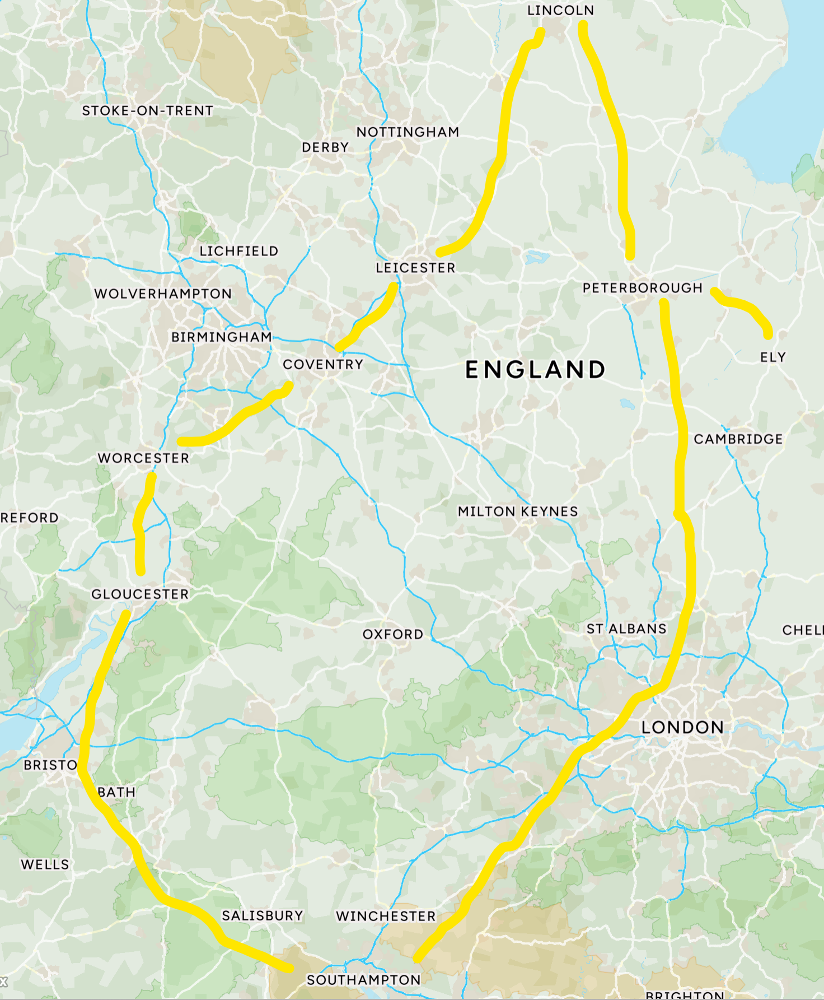{#fig-route fig-alt="A map of the route visiting seven cathedrals in seven days. Southampton ⟶ Gloucester ⟶ Worcester ⟶ Coventry ⟶ Leicester ⟶ Lincoln ⟶ Peterborough ⟶ Ely ⟶ Southampton" width="412"}

As Ely is close to Peterborough, for ease of getting home, I'm staying in Peterborough for two nights, everywhere else for just one night.

Cost wise, I reckon this could have been done for half the approximately £1000 I'm spending, £700 of which is accommodation (@sec-hotels) . My full itinerary with costs is at the end (@sec-plan). Although money does matter, keeping the costs down wasn't the priority, and much of extra cost is because I booked accommodation at the last minute instead of months ahead, and I've chosen to stay in Premier Inns rather than cheaper places. I'm on my own so, the cost doesn't get split between two people. I chose to do this as I prioritised comfort, these rooms have fast internet and a fridge, and I know the soundproofing is generally good in Premier Inns, and I'm pretty noise sensitive (I am taking ear plugs just in case.) For comparison, a [nine cathedral all inclusive group tour with an expert guide](https://www.martinrandall.com/tours/the-cathedrals-of-england) was priced at £3,490 per person at the time of writing in 2025.

The plan is do a tour of the cathedral in each city (@sec-tours) , along with optional side missions (@sec-side-missions) and then to write up my thoughts, notes and any pictures I take here at the end of each day.

### Load out {#sec-load-out}

My plan is to travel light, so I've got one bag (@fig-talon) with my daypack inside (@fig-daypack). Not sure of the total weight, but I imagine it's 8 or 10 kg. If I have the opportunity I'll weigh it. I walk a fair amount, and this is a very comfortable bag so I know this is fine for several hours if I need to walk with it for an extended time, but my intention is to leave this at the hotel and just carry my daypack around.

{#fig-talon fig-alt="My Osprey Talon 44 litre rucksack with everything I packed. Estimated 8-10 kg total weight which I can comfortably walk with for several hours." width="316"}

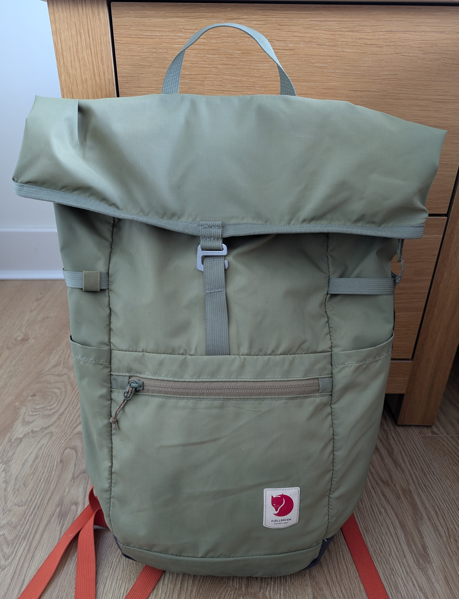{#fig-daypack fig-alt="My daypack that I'll be carrying around once I've left my main bag at the hotel my big pack." width="383"}

Although I'm staying in hotels I've planned it a bit like camping and taking stuff I can use in the hotel for meals if I don't want to eat out. My 750 mL steel cup with a lid is multi-functional and my 1L Nalgene water bottle nests inside it (@fig-cup). Although I'm not packing any food, it can be used to heat pouches of food food such rice or chilli . I can use it as a teapot for brewing tea in the morning, hence the tea strainer (I decided I'll get coffee out) or for eating out of if I need a bowl. I expect I'll have porridge for breakfast at least some of the time.

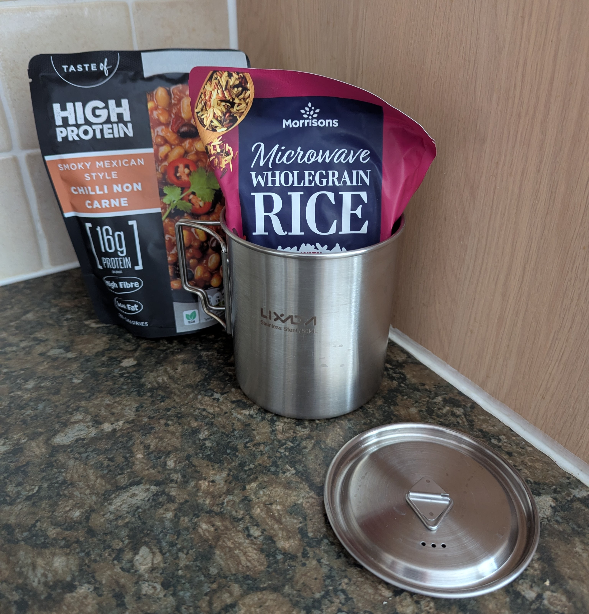{#fig-cup fig-alt="My 750 mL stainless steel cup with lid and rice and chilli food pouches. I'm not planning to pack food as I can buy it, but this just shows how food pouches can be heated using the mug and boiling water from a kettle if necessary." width="480"}

@fig-kitchen shows all my food and drink stuff I might need. My steel lunchbox has some nice [Assam tea leaves](https://what-cha.com/products/india-assam-latumoni-special-handrolled-black-tea) on top. Along with a spoon and spork, my little red Victorianox knife is also versatile and great for chopping tomatoes or other salad type foods. I've got a bottle opener, tea strainer and my multi tool which has scissors. And some washing up liquid.

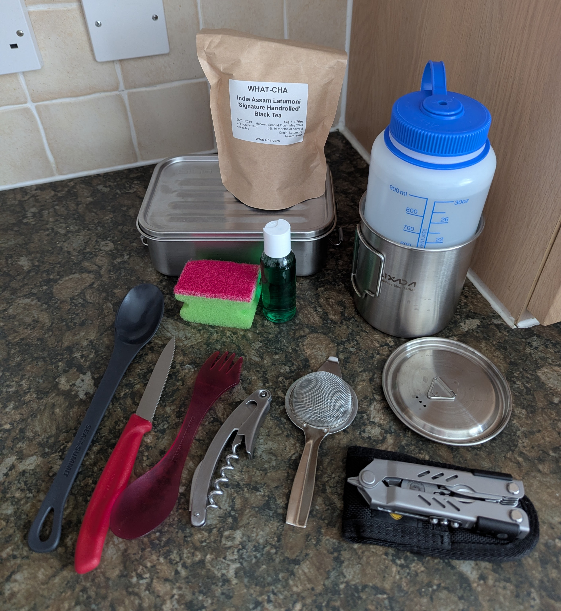{#fig-kitchen fig-alt="Food and drink stuff: My steel lunchbox, steel mug with nested water bottle. Long spoon, knife, spork, bottle opener, tea strainer, sponge, washing-up liquid, multi-tool and some Assam tea." width="460"}

@fig-luggage shows everything else other than my electronics. I'm only taking three days worth of clothes, so I'll need to do some washing and hang my clothes up hence the clothes pegs and paracord. I've got waterproofs and some warm layers if it gets chilly when I'm outdoors. I'll be wearing my waterproof trainers. All my clothes are in a waterproof 12 litre stuff sack. Like many people I've concluded it's best to pack things in waterproof bags inside my pack, rather than trying to cover the pack itself. I use a combination of zip-lock bags (which are also good for food prep on the go), bin liners and proper stuff sacks. I've got my foam sit-mat which is handy if wherever I want to sit is wet, dirty or cold. My washbag has all the usual stuff, plus any first aid type things and aforementioned earplugs. My chargers and my glasses.

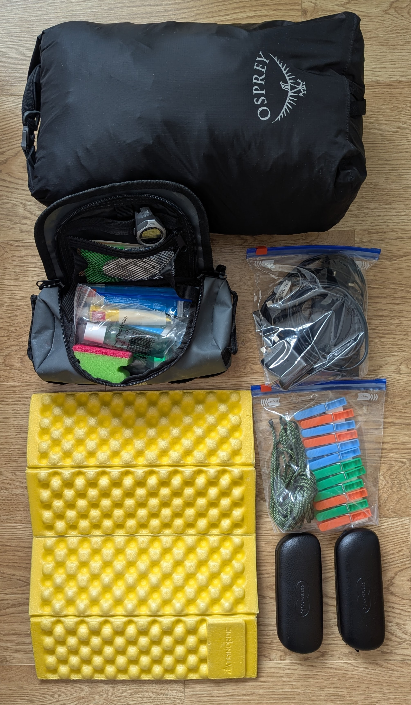{#fig-luggage fig-alt="Stuff I need for the week. Three days of clothes, plus waterproofs and warm layers inside a 12 litre waterproof stuff sack. Washbag with first aid kit and a watch. Chargers, washing line and clothes pegs in zip-lock bags. Foam sit-mat. Glasses. " width="408"}

## Day 1: Gloucester {#sec-gloucester}

Train leaving Southampton at 0911, change at Bristol Temple Meads to arrive in Gloucester for lunch. I split my ticket, saving me £14.50.

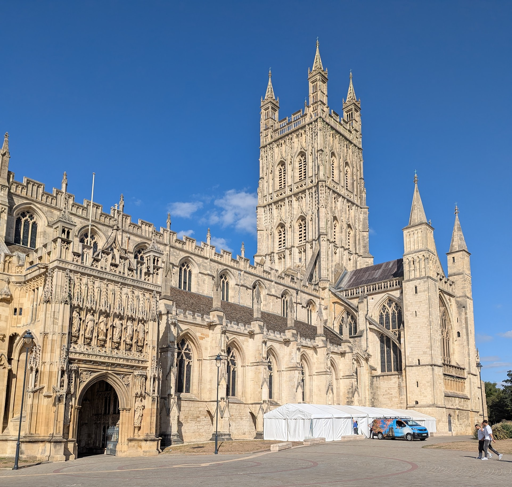{#fig-glou-cath fig-alt="Gloucester Cathedral in the sunshine" width="100%"}

Having walked half a hour to the hotel and dropped off my bag, I ate my lunch outside the 1300 year old [Gloucester Cathedral](https://en.wikipedia.org/wiki/Gloucester_Cathedral) (@fig-glou-cath) and heard the [Thursday 1pm Bells](https://gloucestercathedral.org.uk/cathedral/heritage/clocks-bells-and-chimes). After lunch I explored the cathedral for and hour before taking the final tour of the day at 3pm.

Fair play to Rod the retired GP and now enthusiastic volunteer cathedral guide for the [Highlights Tour](https://gloucestercathedral.org.uk/visit/things-to-see-and-do/guided-tours), he did an excellent job. I highly recommend it. In a packed hour, as well as telling me and a couple from Cheshire all about the history of the cathedral, he told us about Gloucester from it's origins as a Roman settlement and connected everything to the history of England. As a history know-nothing it dropped the penny on a few things local to me Southampton, such as why [Netley Abbey](https://en.wikipedia.org/wiki/Netley_Abbey) is ruin (the Reformation), and the [Rufus stone](https://en.wikipedia.org/wiki/William_II_of_England#Rufus_Stone) in the New Forest (king got shot). And he also told us lots of excellent trivia, such as about the [stained glass windows](https://www.visitstainedglass.uk/location/gloucester-cathedral-gloucestershire): some the ones in the Lady Chapel were by [Christopher Whall](https://en.wikipedia.org/wiki/Christopher_Whall), and the main window was once the biggest in the world. Or the masons marks on the blocks were how they got paid and we can only see them because of the Reformation. There was even a gay love story.

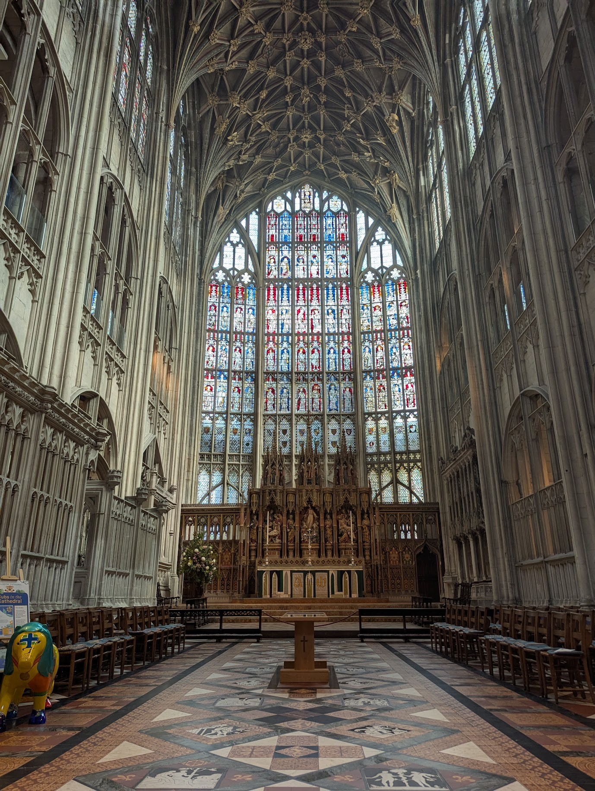{#fig-glo-windows fig-alt="Stained glass windows at Gloucester Cathedral" width="100%"}

The cathedral was originally an Abbey and has amazing cloisters (@fig-glo-clo ). I've never watched Harry Potter (or read the books) but apparently they did a lot of filming there.

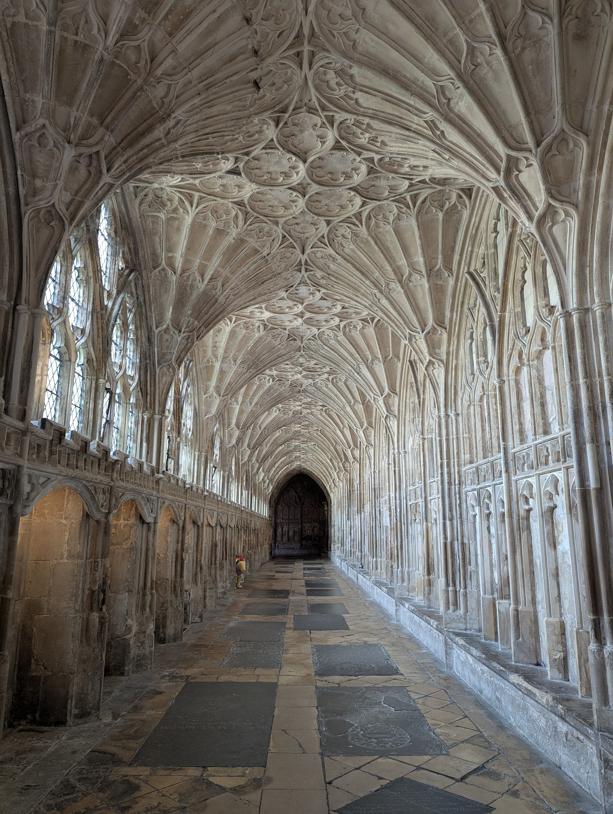{#fig-glo-clo fig-alt="Cloisters at Gloucester Cathedral" width="100%"}

They have an active stone masons workshop and lots of restoration is going on all the time, but they also add new additions too, such as this [Forest of Dean Miner gargoyle](https://www.bbc.co.uk/news/uk-england-gloucestershire-50781516) in 2019. They have lots of cool gargoyles.

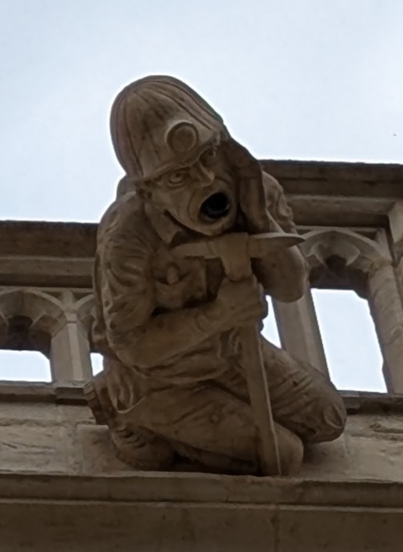{#fig-glo-miner fig-alt="Miner Gargoyle with a helmet and pick axe who looks like he is shouting down from the cathedral. Water comes out of his mouth." width="50%"}

Finished my day with a pint of New England IPA at [Warehouse 4](https://www.gloucesterbrewery.co.uk/) whilst watching the House Martins fly around over the Quayside and then got some pizza to serve as both dinner and lunch tomorrow. Gloucester itself seems quite a place of contrasts. Here on the quayside I watched a running club meeting and earlier it was courting teenagers hanging out and it's shiny. In the centre and by the cathedral it was a lot of community protection officers and people who's lives appeared dominated by drugs and alcohol. Signs of a fair amount of homelessness. Everyone has been friendly though.

## Day 2: Worcester

Train Fri 22 Gloucester (GCR) 0854 -\> Worcester Foregate Street (WOF) 0947.

Not sure if this will become a theme about the state of English cities, but in both Gloucester and Worcester I've got off the train and almost immediately encountered a large number of mostly men who appear to have drug or alcohol issues. And many of the people in the shopping streets I walked through looked to be having hard lives.

In contrast, in both cities there is lots of beauty and wealth, such as [Worcester Cathedral](https://www.worcestercathedral.org.uk/) on the River Severn with its swans and canal boats (@fig-wor-cath).

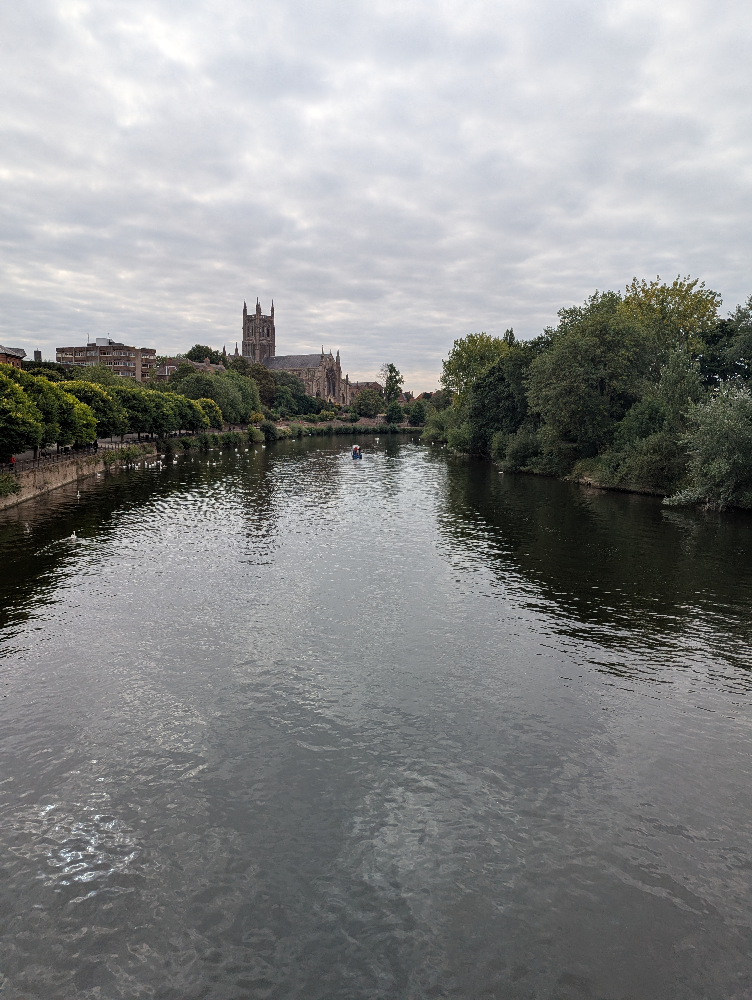{#fig-wor-cath fig-alt="Worcester Cathedral on the River Severn with a canal boat and swans in the river."}

I dropped off my bag and headed back across the river to the cathedral side for coffee. Reddit can be hit and miss, but again it came up trumps with the recommendation of Colombian Cafe [Francini](https://francinicafe.com/) in which I had a lovely smooth mellow cup of filter coffee with their version of an almond croissant, which was more like a warm gooey frangipane (@fig-francini). I didn't sleep well, so this was just the ticket.

::: {#fig-francini layout-ncol="2"}
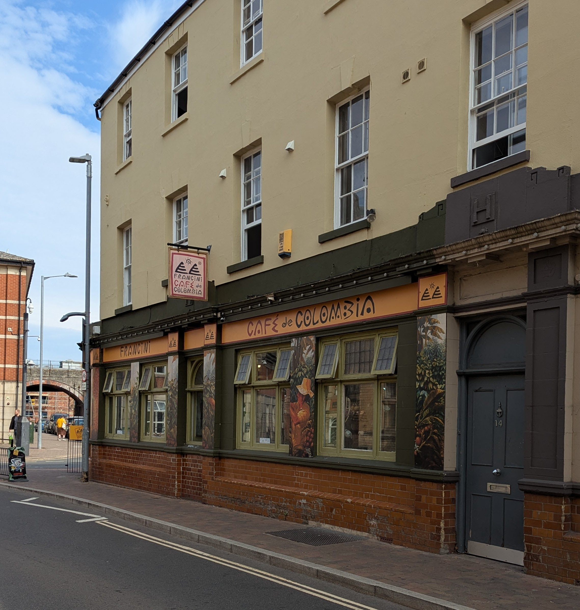{#fig-fran}

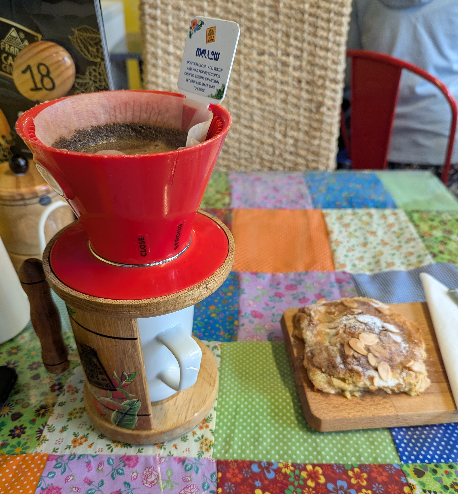{#fig-fran-coffee}
:::

I was originally thinking that I'd go watch a one-day cricket match that was on as I've never been to a cricket match, but I'm not very good at sitting still for any length of time (another reason I don't like flying) and as the weather was not too hot, but dry I elected to walk along the Severn before the cathedral tour at 1430. I remembered this was the start of the [Monarch's Way](https://en.wikipedia.org/wiki/Monarch%27s_Way), which is such a long looping footpath, I feel like it's one of the paths I've crossed or walked on most.

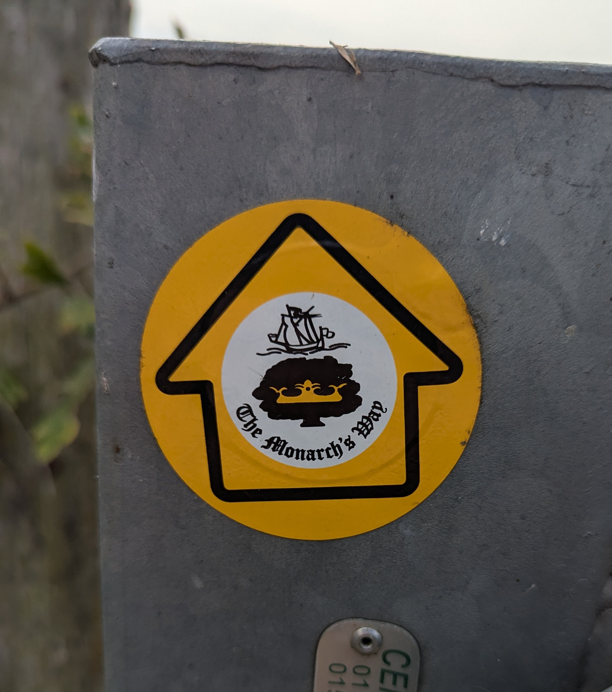{#fig-mon-way fig-alt="Image of the yellow arrow sign for the Monarch's Way on a gatepost" width="25%"}

I walked downstream for about and hour, past the swan sanctuary and heard and saw lots of other birds including raptors, goldcrests, chiffchaffs and saw dragonflies, and with the Malvern Hills on the horizon it felt more like being Southern France than in England. I ate my leftover pizza for lunch in the shade near Diglis Lock.

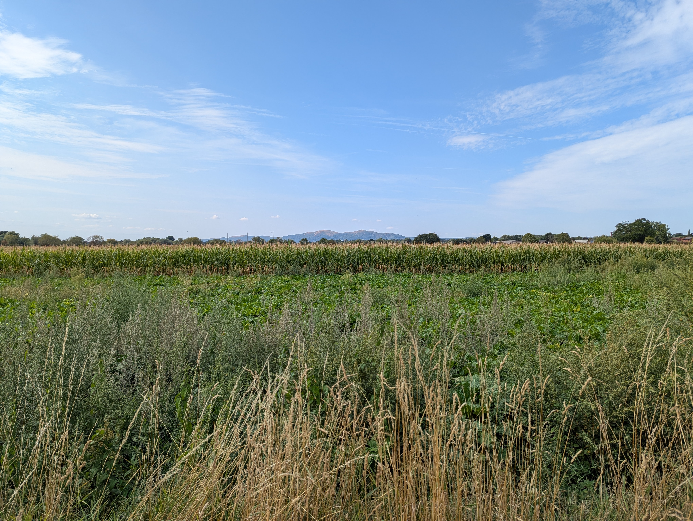{fig-alt="View of the Malvern Hills from the Monarch's Way on the River Severn"}

Then I headed up to Worcester Cathedral for the Highlights Tour. The guide David was much lower energy than Rod at Gloucester, but he made up for it by giving the four of us on the tour well over an hour and an abundance of history. One of the things I'm picking up is how these are living buildings which capture the history of the people who've lived in these places for all this time, as well as the story of the country as a whole. For example, in Worcester one set of columns was finished before the Black Death and the other afterwards, and the difference once you notice it is striking. The pre-plague ones are more highly decorated as there was more money and masons. Likewise the cathedrals absorbed all sorts of beliefs, in Gloucester a previously Pagon Saxon Chief is entombed by the High Altar and in Worcester they have stone carvings with all sorts of imagery that's not from the bible such as @fig-wor-spangle .

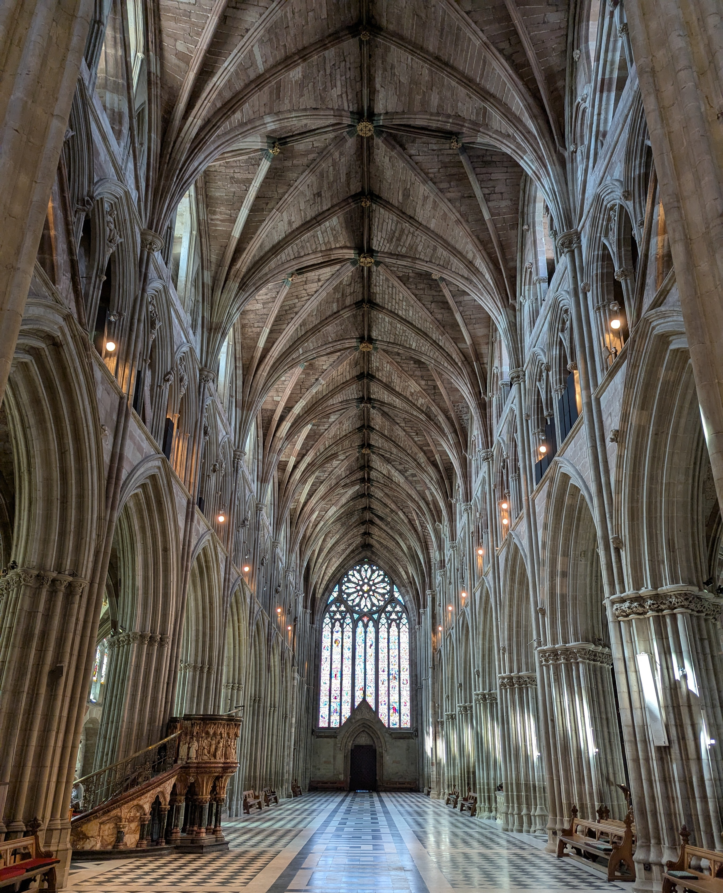{#fig-wor-nave fig-alt="The nave and stained glass window at the western entrance of Worcester Cathedral "}

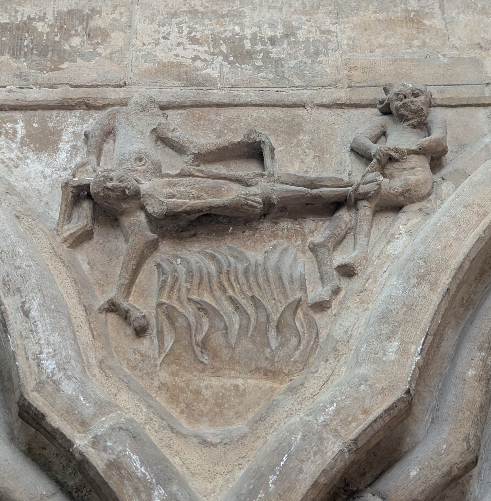{#fig-wor-spangle fig-alt="Stone carving of someone being roasted on a spit"}

After the tour, I headed to the hotel to check-in and discovered my room had a view of the cricket match (@fig-wor-crick) and there was still about 2 hours left to play, so I popped to the supermarket for food for breakfast and lunch, and then watched Worcester beat Glamorgan with just a few balls to spare.

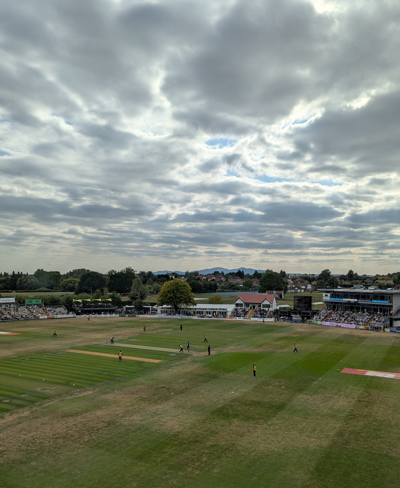{#fig-wor-crick fig-alt="View from my hotel room of Worcester batting against Glamorgan in a one day cricket match. Worcester won!"}

Having be outside so much today, and after yesterday's 10 miles of walking I'd clocked up another 12, I decided to get takeaway and beer and eat in my room. I had Tofu Yaki Soba from [Maneki Ramen](https://maneki-ramen-worcester.square.site/) and it was delicious. Another Reddit recommendation.

## Day 3: Coventry

Train from Worcester Forgate Street (WOF) 0924 -\> 1009 Birmingham New St (BHM) 1021 -\> Coventry (COV) 1042.

Saturday was a bit different to the previous two days as there was no guided tour of [Coventry Cathedral](https://www.coventrycathedral.org.uk/) and I'd bought a ticket to watch Coventry City FC versus Queens Park Rangers at 1500, their [stadium](https://en.wikipedia.org/wiki/Coventry_Building_Society_Arena) being half an hour by bus from the city centre. I dropped my stuff at the hotel around 1100 and then wandered over to the cathedral. The centre of Coventry has quite a lot of renovations ongoing and completed in the last few decades so it's a real mix architecture. As per English cities so far, a fair amount of homelessness, but the alcohol and drugs weren't really noticeable until after I got back from the football. I guess people were still in bed in the morning.

So you probably know that Coventry Cathedral was fire bombed in 1940 and they built the new one next to the remains of the old one, finished in 1962. What I didn't know was that the old one wasn't that old in the first place. It had been finished in [1918](https://en.wikipedia.org/wiki/Coventry_Cathedral), so didn't last long. Part of what I learnt at Worcester is that the word cathedral means "seat of the Bishop" and that there are 42 Church of England dioceses which are the areas the Bishop oversees. And the Worcester diocese, which was founded in 679, had both Gloucester and Coventry carved out of it to make those dioceses. And if you're wondering Guildford is the newest cathedral in England. But the Catholic Church had a presence on the site from 1102 to 1539 when the reformation did for it.

Something else I learnt at Worcester was that cathedrals are usually laid out west to east, with the entrance in the west end and high altar in the east end. And the 1918 ruins are laid out that way (@fig-cov-old-cath ). But the new one is laid out at right angles to the old one, running south to north. I asked about this and the volunteer told me that it was the only space available to build on, and the two sites connect.

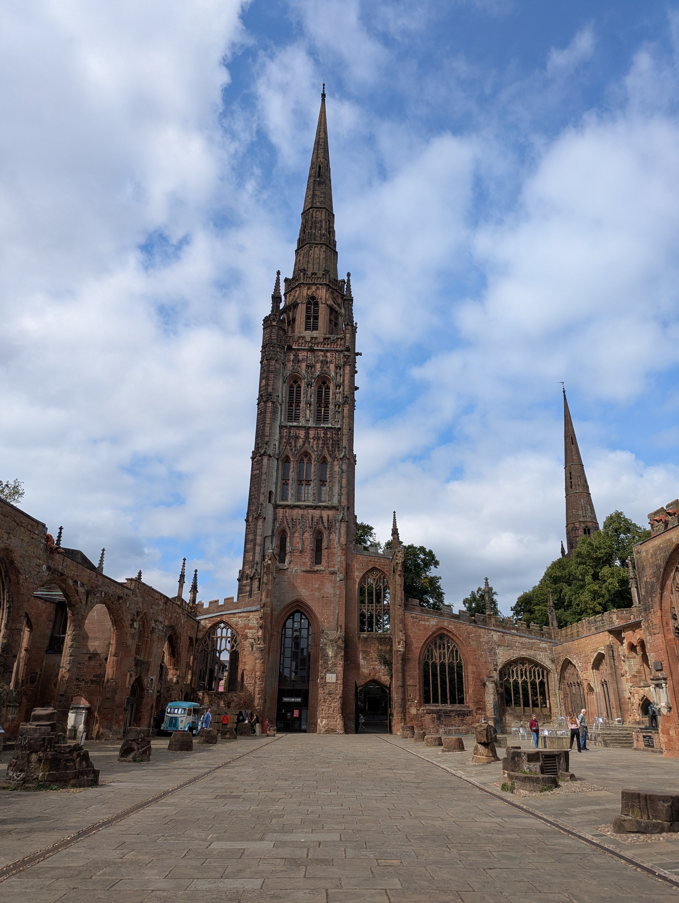{#fig-cov-old-cath fig-alt="Coventry Cathedral ruins, looking towards the western entrance and tower. There are some walls, but no roof."}

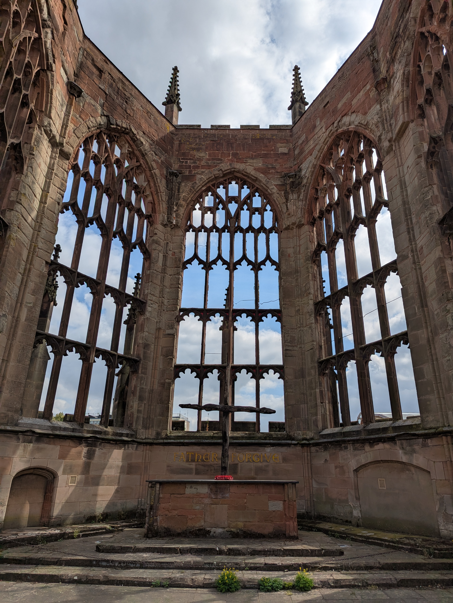{#fig-cov-old-alt fig-alt="High altar and the east end of the ruins with a cross is burnt wood from the fire bombing."}

Personally I think the new one is a vast improvement on the one that got destroyed. I don't know if it's because Gloucester and Worcester are so much about power and royalty, or whether it's the Basil Spence connection (he help redesign the University of Southampton campus in the 1960s) but Coventry cathedral felt the most like a spiritual place. I only had time for a short visit, less than half an hour compared with the two hours at the others previously. I'd like to come back and spend longer and visit a few other things in Coventry too. The stained glass was amazing and even though it's an Anglican cathedral it felt more flamboyant in a way I associate with a Catholic cathedral.

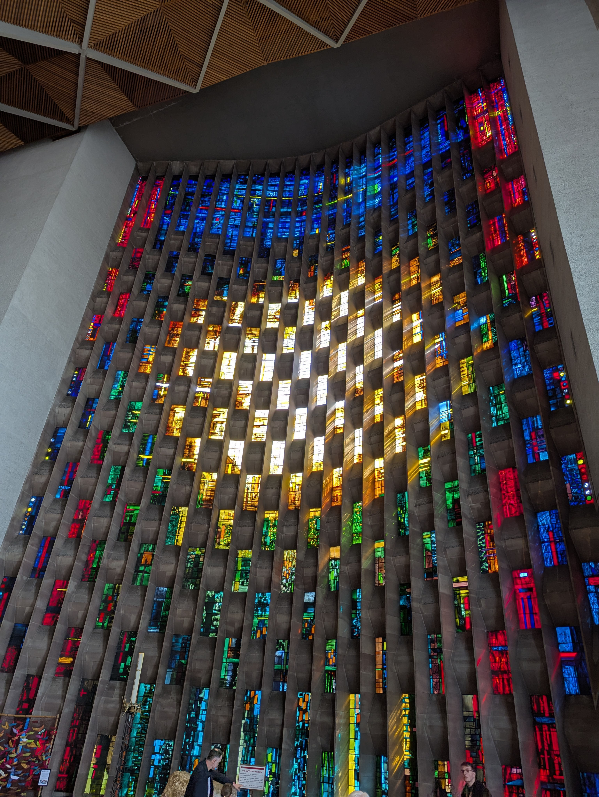{#fig-cov-glass fig-alt="Stained glass window in the new Coventry cathedral"}

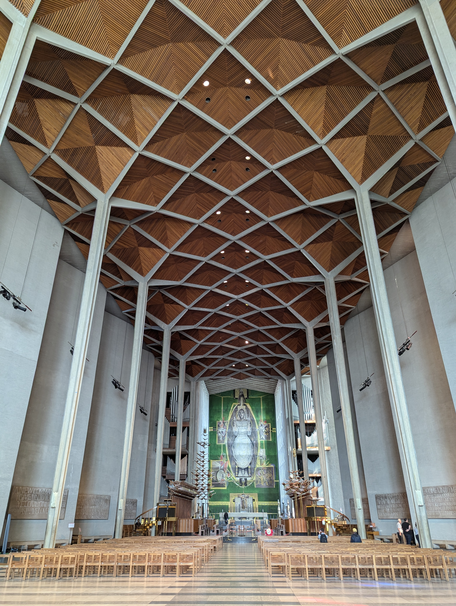{#fig-cov-nave fig-alt="The nave and choir in Coventry cathedral"}

I grabbed a sandwich from Sainsbury's and then caught a bus up to the football stadium. I didn't have many expectations, although I knew Coventry were playing well and QPR had not been doing well. I did not expect eight goals! QPR were rubbish and Coventry played well, so it meant I was surrounded by thousands of happy people including the old geezer giving a running commentary behind me about everything going on. He had a lot of opinions. I forget how different live sport is to TV, they do show replays on the big screen, but you can easily miss things and also see lots of things the camera doesn't catch.

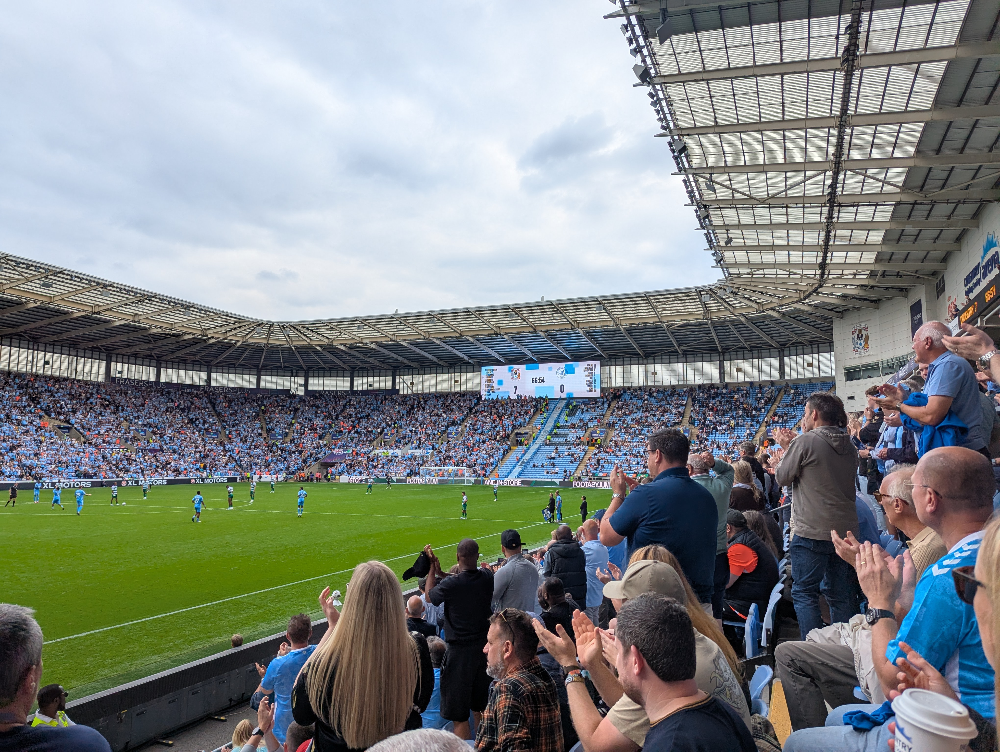{#fig-cov-fc fig-alt="View from my seat at Coventry FC vs QPR. A 29,000 seat stadium."}

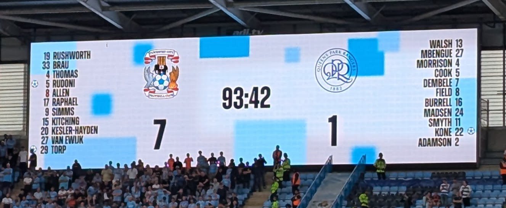{fig-alt="An image of the final scoreboard. Coventry 7, QPR 1"}

I got the train back in as it was a bit quicker than the bus and grabbed a pizza from [Mamma Margherita](https://mamma-margherita.com/) as it makes lunch tomorrow as well as dinner tonight. I haven't eaten out yet. I feel a bit weird dining alone, even though I know it's perfectly normal. Anyhow, the pizza was decent, but not amazing. Better than Zizzi or Pizza Express.

Oh, and when I got back to the hotel I found a police officer posted outside the room two doors down. She told me she'd be here for a while, so I have extra security tonight. No I didn't ask why she was there, and I chose not to make a joke about getting her some pizza.

## Day 4: Leicester

Arriva X6 Bus from Pool Meadow Bus station Coventry 1015 -\> Leicester 1120 £3

No sign of the police when I left this morning.

Starting with the bad to get it out of the way and write about more positive things. Arriving mid-morning on a Sunday in the centre of Leicester I encountered the largest number of people who's lives are not going well on my trip so far. Lots of people begging quite aggressively or passed out in doorways, and when I went for a walk along a river and canal route that I'd downloaded, after I'd visited the cathedral, I got quite a few predatory looks from those on the towpath and a close encounter with two lads in balaclavas on an e-bike. Nothing bad actually happened, but it's the first time I've felt unsafe and wouldn't recommend that walk alone. Likewise someone had been around putting up England flags on lampposts and fences using cable ties, and I wondered if that was related to far right attempts to appropriate the flag for racism, after years of the rest of us reclaiming it from them. Having had a run-in with some up-to-no-good teenage boys in my own neighbourhood last week, and had to remove a Reform sticker put up by our cleaners on our front door (!) I know these issues are everywhere. And as I've said many times, I reckon much of the anti-social behaviour is linked to the weather and all the fair weather fascists and naughty boys go home as soon as it gets wet or cold. And despite the hysteria from people who are radicalising themselves on-line about boiling point Britain, as I'd expect, pretty much everyone I've encountered seems to be just trying to live their lives and make the best of things, despite the 17 years of year-on-year decline since 2008.

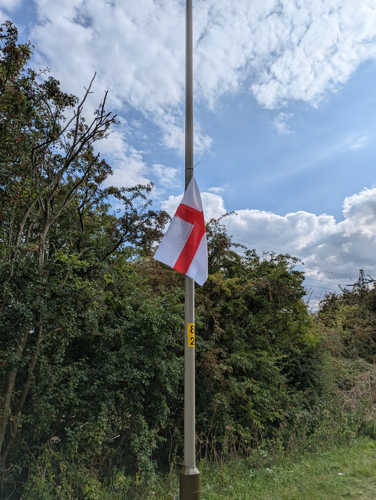{#fig-flag fig-alt="A red and white England flag cable tied to a lamppost in Leicester " width="50%"}

Ok, having got that out of the way, from the bus I navigated to the hotel to drop my bag, I then went to find [Leicester cathedral](https://leicestercathedral.org/). It's by far the least grand cathedral so far on this trip, but turned out to be a bit of a gem. I reckon you could fit at least two Leicester cathedrals inside Worcester and Gloucester.

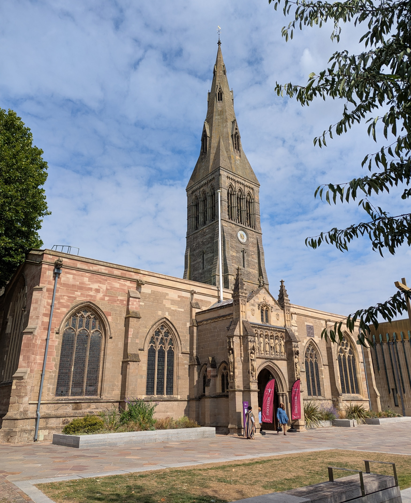{#fig-lei-cath fig-alt="Leicester cathedral in the sunshine"}

It was pretty peaceful outside when I arrived, so I sat in the shade and ate my lunch before heading inside where I was pleasantly surprised. It's got a bit of an [history](https://en.wikipedia.org/wiki/Leicester_Cathedral) as a cathedral, the current building is Victorian and the diocese re-created in 1927, but the site sits on top of a Roman Villa of which they have a stone in the new extension and there was a previous diocese from 680 to 870. It's famous now following the reburial of Richard III in the cathedral in 2015, after which they did a lot of renovations in 2022. You can see the new and cleaned limestone in @fig-lei-cath, as well as the new grotesques they put in to replace the eroded gargoyles (@fig-lei-gro). I particularly liked the sheep, and of course for Leicester, a fox with a chicken.

::: {#fig-lei-gro layout-ncol="2"}
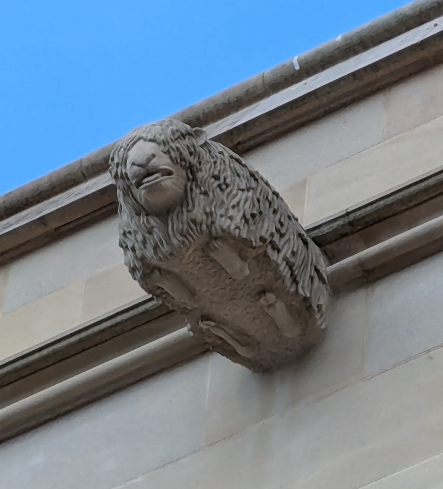{#fig-sheep fig-alt="Sheep grotesque" width="100%"}

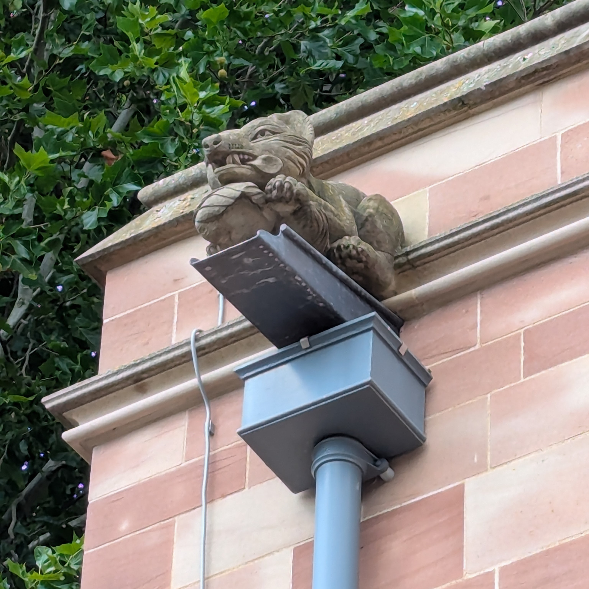{#fig-fran-fox fig-alt="Fox grotesque"}

Leicester cathedral grotesques
:::

Inside they'd replaced the floor and lots of the stonework too @fig-lei-nave , as well as painting the ceiling with stars in parts and cleaning everything (@fig-lei-ceiling) .

::: {#fig-lei-inside layout-ncol="2"}
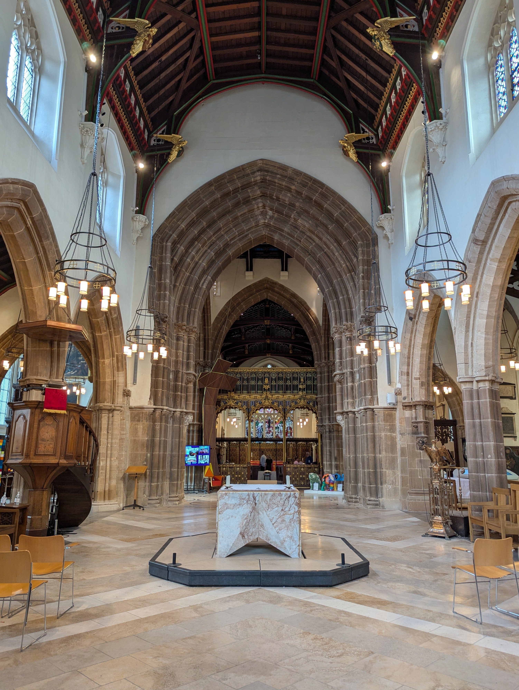{#fig-lei-nave fig-alt="Facing east down the nave, screen where Richard III is buried and the high altar beyond" width="100%"}

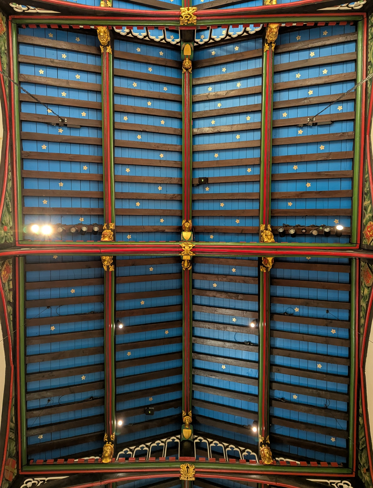{#fig-lei-ceiling fig-alt="Renovated wooden ceiling painted blue with gold stars"}

Inside Leicester cathedral
:::

There was a small exhibition of patchwork quilt art that I enjoyed too. I particularly liked the one called Hope.

::: {#fig-lei-quilt layout-ncol="2"}
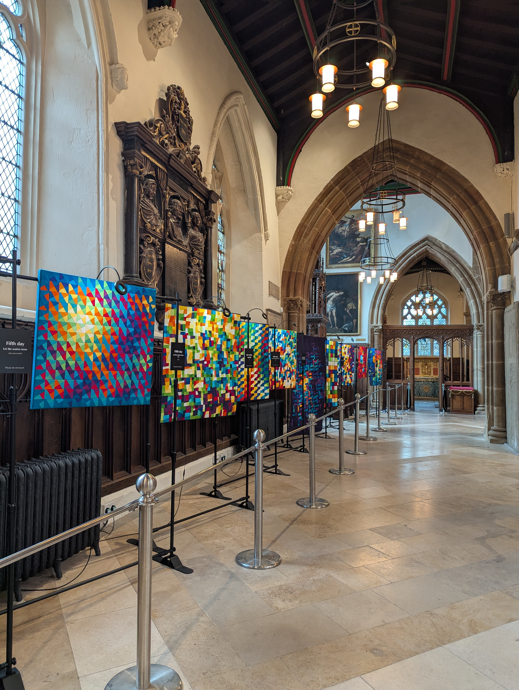{#fig-lei-quilts fig-alt="A collection of mulitcolored geometric quilt art inisde the cathedral" width="100%"}

{#fig-lei-hope fig-alt="Multicoloured quilt art called Hope"}

Quilt artwork in Leicester cathedral
:::

Leicester itself is the definition of faded glory, all the signs of a once wealthy and powerful city gone to seed, but with some signs of regeneration too. It's on the River Soar and Grand Union canal and I realised in Worcester, I really prefer walking to anything else. As I use the OS maps app, I download the route in @fig-lei-walk-route as it had a good review, looked the right length/duration etc. As I wrote above it was somewhat marred by some not so friendly looking people, but the route was lovely (excepting all the rubbish and signs of drug use) and there were also lots of families and couples out too, including two middle-aged women discussing toxic masculinity. I saw lots of birds and fish and the light was very nice too (@fig-lei-canal).

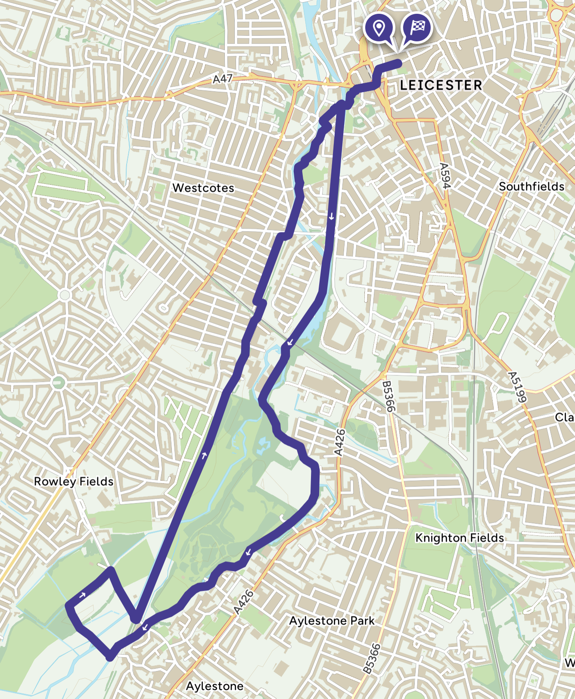{#fig-lei-walk-route fig-alt="Map of 10km walk route along the River Soar and Grand Union Canal" width="50%"}

::: {#fig-lei-walk layout-ncol="2"}
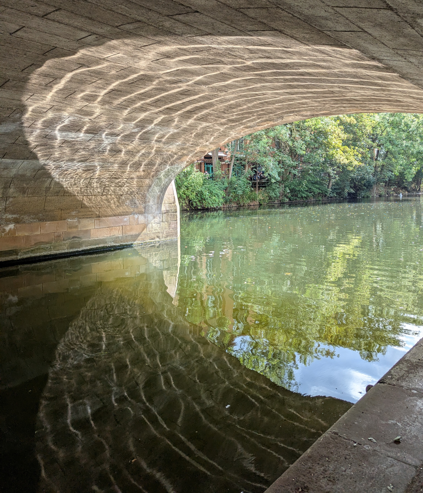{#fig-lei-reflect fig-alt="Light reflecting from the water on the underside of bridge." width="100%"}

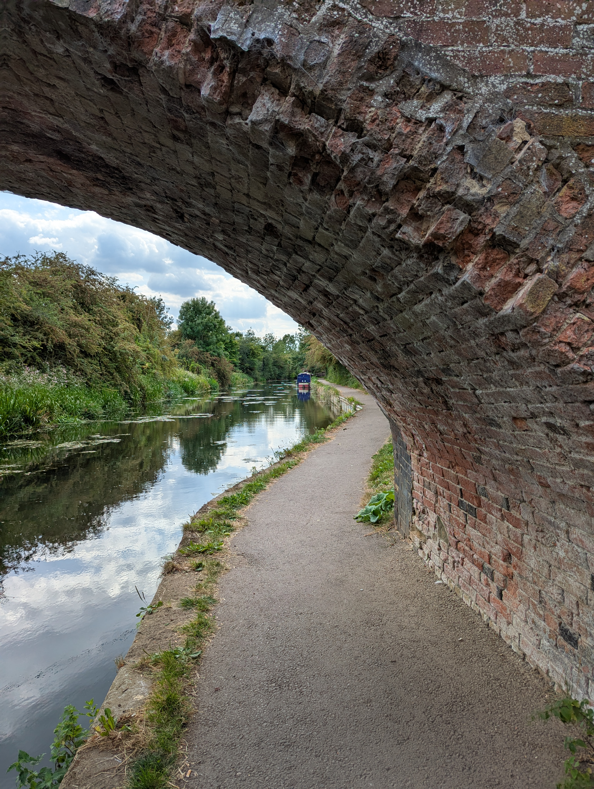{#fig-lei-canal fig-alt="A view along a canal through a bridge with a narrowboat."}

Along the Grand Union Canal in Leicester
:::

I walked back via the campus of De Montfort University which was pretty impressive and the [Queen's Building](https://www.dmu.ac.uk/about-dmu/news/2023/march/the-queens-building-at-30-a-look-back-at-its-storied-history-and-exploration-of-the-futuristic-building-design..aspx) was a particularly interesting bit of architecture. And New Walk was an impressive avenue too. Despite my bad first impressions, I feel like there's a lot to discover and enjoy here.

On my way out to pick up my enormous curry, a masala dosa from another excellent Reddit recommendation: [Kayal](https://kayalrestaurant.com/), there was a lady in traditional Muslim dress trying to take photos of herself in the hallway. I ended up taking about 10 pictures and a video for her socials before her daughter and son-in-law arrived. Apparently it was the last of 6 days of wedding celebrations. That and the curry being delicious meant the day has ended on a nice note.

## Day 5: Lincoln

Train from Leicester (LEI) 0944 -\> Lincoln (LCN) 1131 £16.30

The trip from Leicester to Lincoln by train is a nice one. Just under two hours via Loughborough and Nottingham through the countryside. The countryside is very brown everywhere and the rivers very low, so I hope we get prolonged gentle rain soon. Being public transport though it is the proverbial herpes on the Pope's ring - a mixed blessing - sharing a carriage with teenage boys and a bickering husband and wife. Though this may be also a reflection that I'm flagging a bit and my tolerance is lower than usual.

[Lincoln](https://en.wikipedia.org/wiki/Lincoln,_England) meaning "colonial pool" of the same origin as Dublin is "blackpool", the colonial bit referring to the Roman colony, is the poshest and most touristy place I've visited so far. The cathedral appears on the hilltop as the train approaches the city like a building doing a power stance. Unlike Leicester, there's nothing shy or retiring about [Lincoln cathedral](https://lincolncathedral.com/). It's huge and flash and Gothic with a capital G.

::: {#fig-lin-cath layout-nrow="2"}
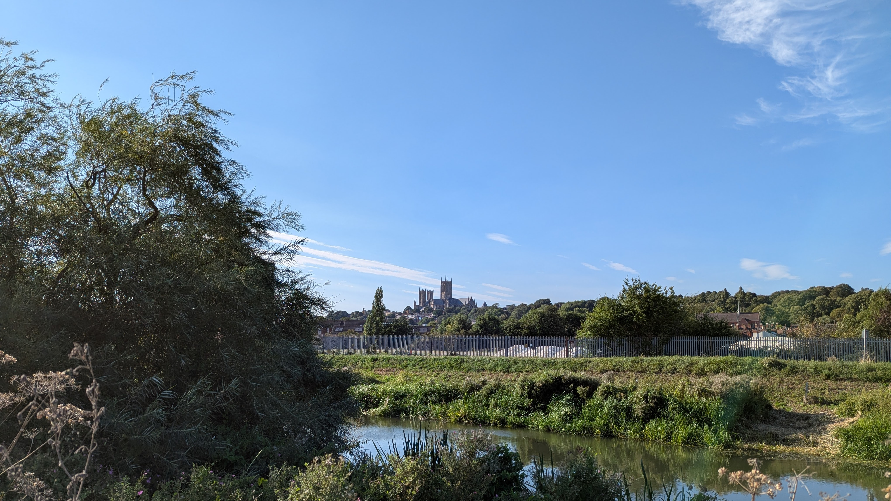{#fig-lin-cath-hill}

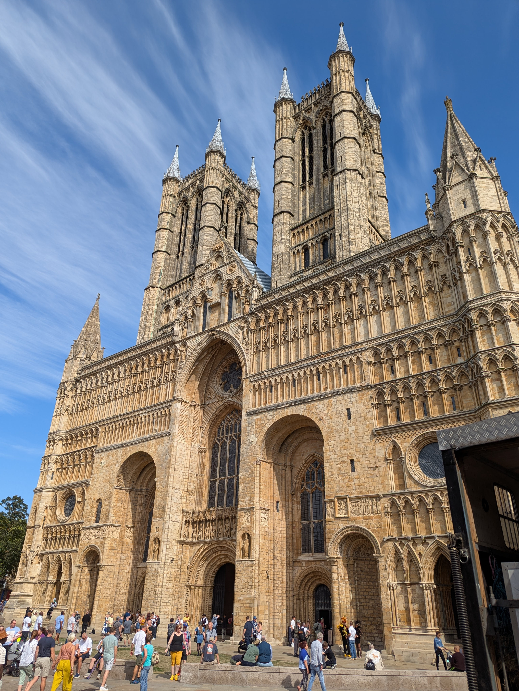{#fig-lin-cath-west}

Lincoln cathedral as seen from the River Witham atop Steep Hill and then close-up of the western entrance.
:::

Being Bank Holiday Monday it was heaving with people. I dropped my bag and then went to M&S and bought some lunch, and slowly made my way up Steep Hill and was going to get a coffee at the cat cafe, but it was shut. No cats for me.

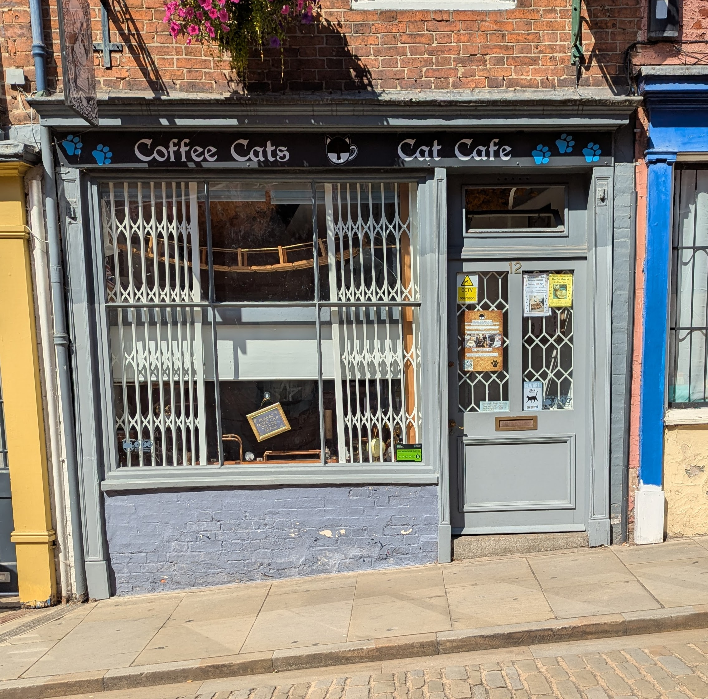{#fig-lin-coffee fig-alt="A closed Coffee Cats coffee shop"}

So I went up and sat in the shade behind the museum and ate my lunch before heading into the cathedral. There were lots of people wandering around in outfits that looked a bit steampunk and it turns out that Lincoln hosts a [huge steampunk festival](https://www.bbc.co.uk/news/articles/cpwyedldy7lo) over the Bank Holiday weekend. Being 27 degrees, everyone looked a bit hot. You might be able to spot some in @fig-lin-cath-west .

Anyway, I went into the cathedral intending to do the guided tour, but there were about 20 other people and the lady had quite a weak voice, so I decided just to self-guide myself. And actually, it's so big I still ended up spending two hours looking around before heading to the hotel to check-in and get out of the heat for a few hours.

Similar story to the others, been a site of religious significance for the best part of 1000 years, grew and fell down and got rebuilt and ransacked during the Reformation and then continues to be rebuilt and restored and is a big site of power and influence in the region. It has one of the copies of the Magna Carta which was drawn up to reign in tyranny and the quote in @fig-lin-mc feels pretty on the nose given what's going on in much of the world at the moment.

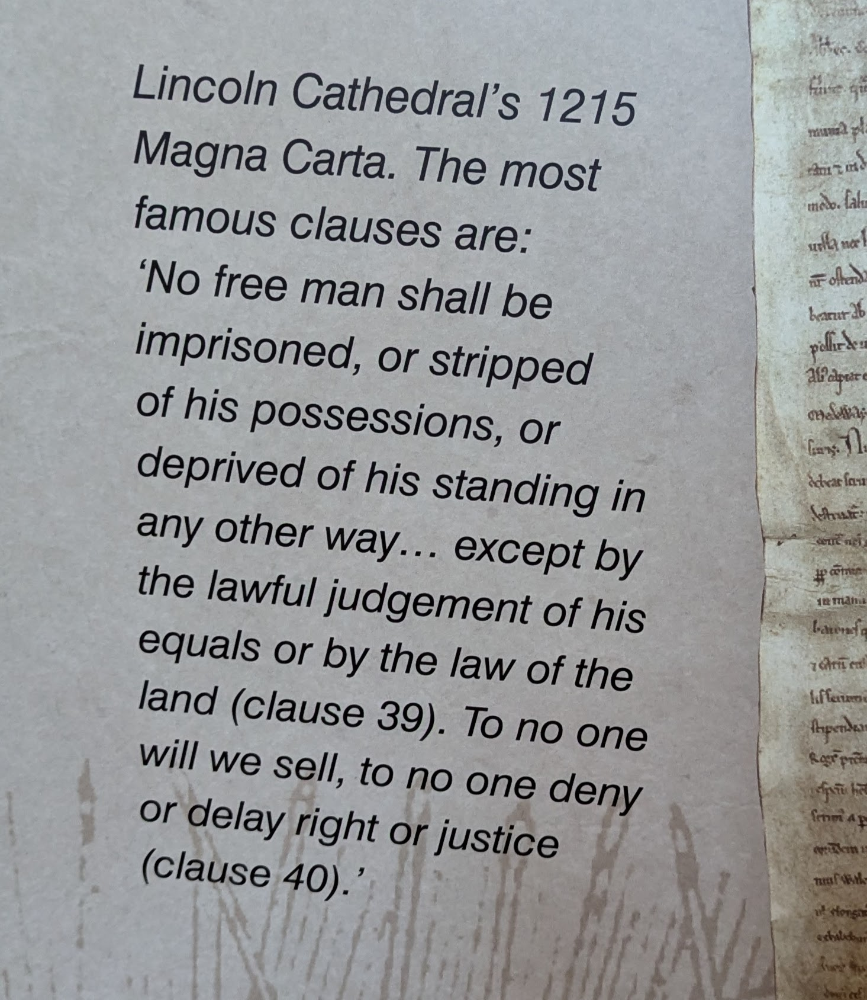{#fig-lin-mc fig-alt="Quote from the Magna Carta about how no-one should be imprisoned without a fair trial." width="50%"}

Here's some pictures in no particular order. The really old font with it's pagan mythical beasts (@fig-lin-font). Light from the stained glass windows (@fig-lin-mc). The nave looking down towards the choir screen and high altar beyond (@fig-lin-nave). The chapter house in which Parliament met and featured in The Da Vinci Code film @fig-lin-chap). And a view of the cathedral from within the cloister (@fig-lin-clois).

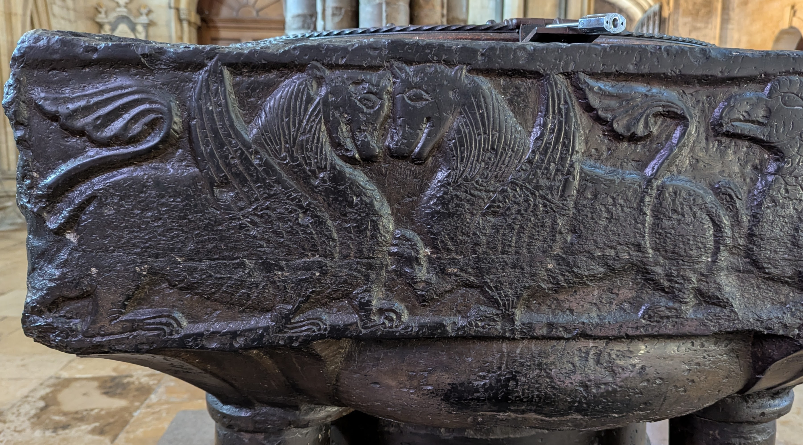{#fig-lin-font fig-alt="Carved mythical beasts fighting on the Lincoln cathedral font. They look a bit like dragons."}

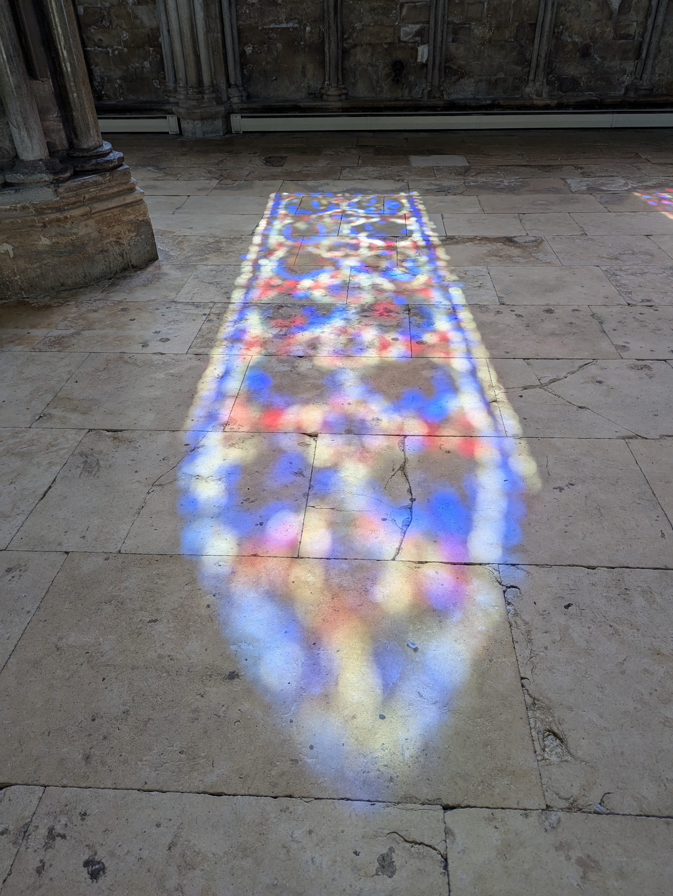{#fig-lin-light fig-alt="Light casts mutlicoloured pattern on the floor of the nave in Lincoln cathedral."}

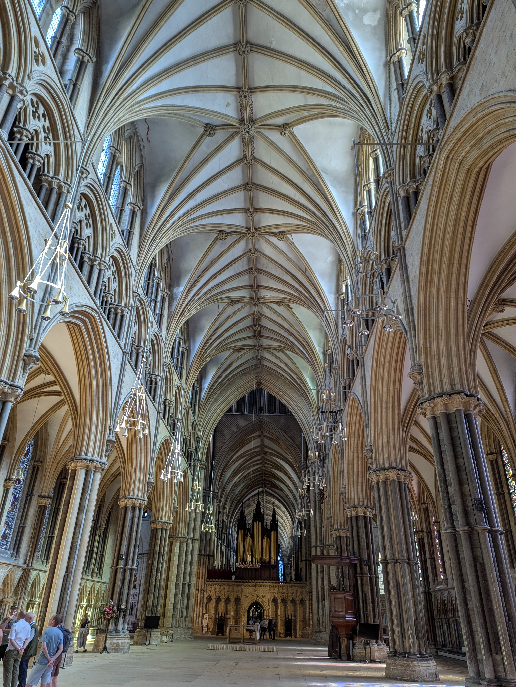{#fig-lin-nave fig-alt="Looking east down the nave towards the choir screen and high altar in Lincoln cathedral."}

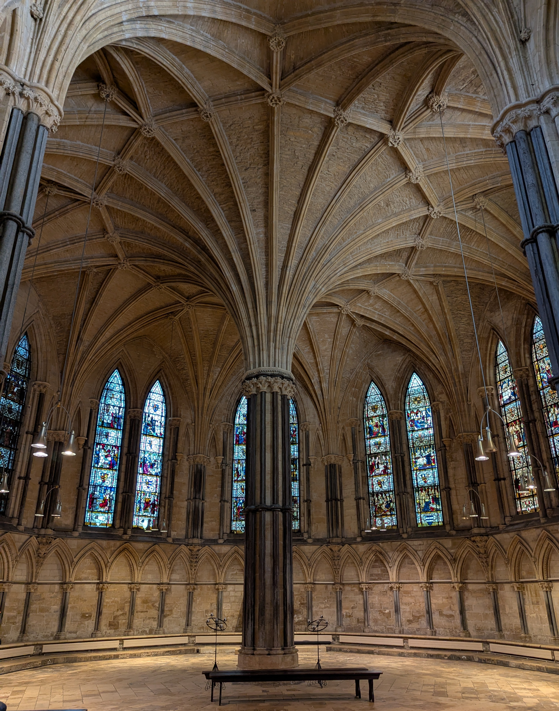{#fig-lin-chap fig-alt="The chapter house at Lincoln cathedral. A round room with a vaulted ceiling supported by a single pillar."}

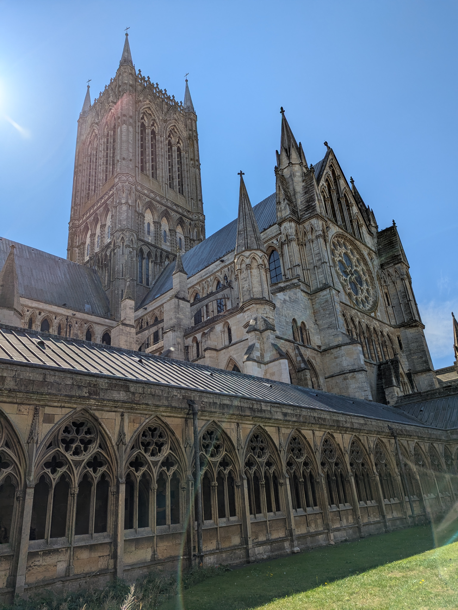{#fig-lin-clois fig-alt="View of Lincoln cathedral from the cloister"}

The Romanesque Frieze: the original and restored version, I of course chose the Sodomy panel to take a picture of. Some medieval stained glass they have saved (@fig-lin-glass).

::: {#fig-lin-fre layout-ncol="2"}
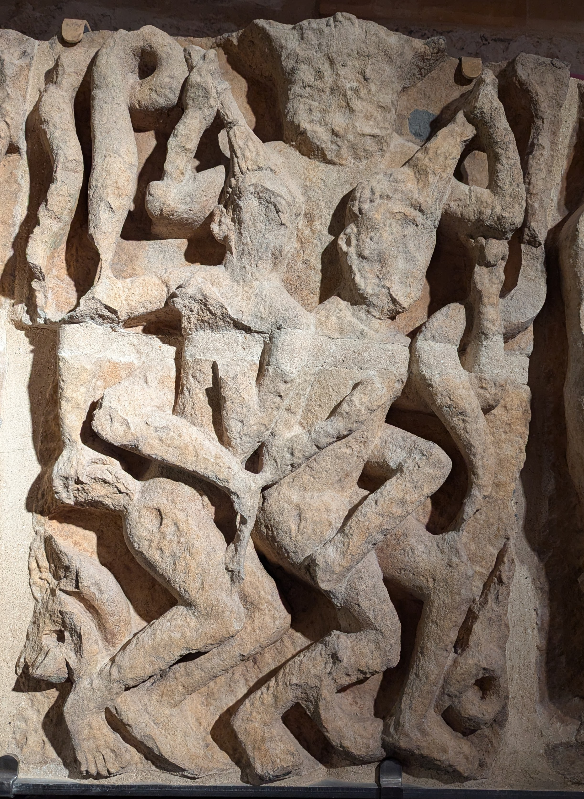{#fig-lin-sod1 fig-alt="The original eroded limestone sodomy panal." width="100%"}

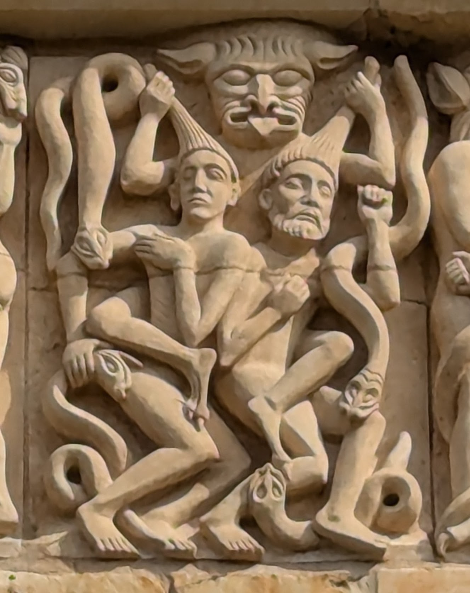{#fig-lin-sod2 fig-alt="The restored limestone sodomy panel."}

The Sodomy panel from the Romanesque Frieze. A 12th century carved frieze which runs right across the facade from the northern corner of the west front around the southern corner, to the southern side of the building. The frieze consists of a series of panels, each a little more than one metre high and varying in width, on which scenes have been carved showing scenes from Heaven and Hell and conveying messages from both the Old and the New Testament.
:::

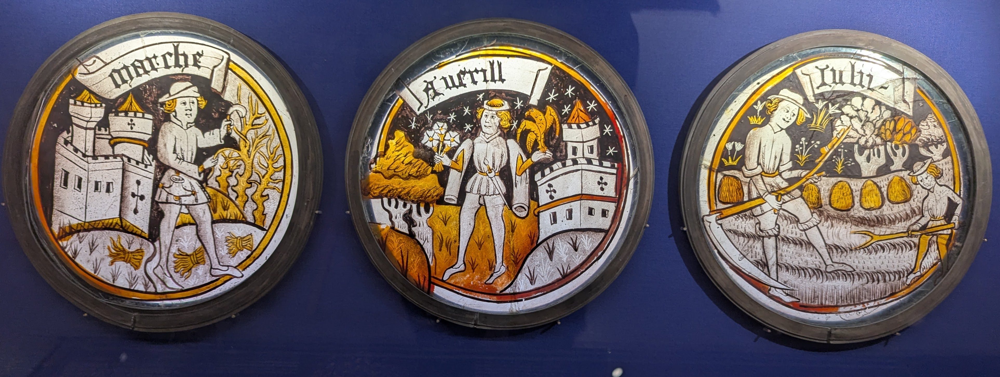{#fig-lin-glass fig-alt="Medeval stained glass windows depicting farming through the seasons from sowing to harvesting."}

As it was so hot, I came back to the hotel as soon as check-in opened at 1500 for a couple of hours to get out of the sun and have a nice cup of tea, before having an early evening river walk along the Steeples and Spires Trail on the River Witham for a couple of hours. It was still hot, but not unbearably so, and I walked out to the balancing ponds and ate my leftover poppadoms (still crunchy) and lime and mango chutney whilst sitting on the dike watching the many swallows feed.

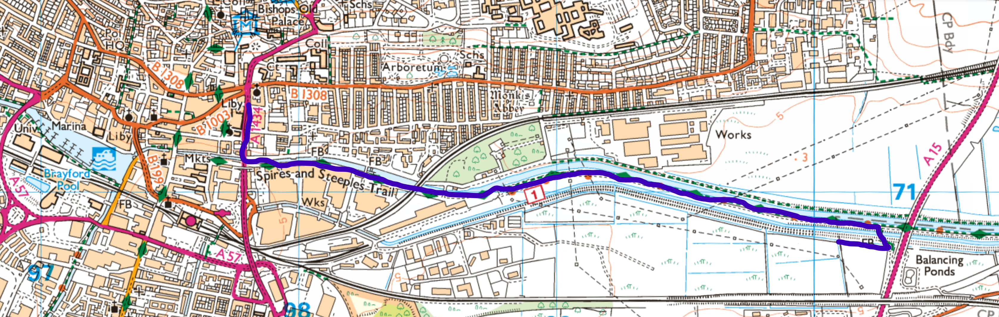{#fig-lin-walk fig-alt="Map of a 90 minute walk along the River Witham in Lincoln"}

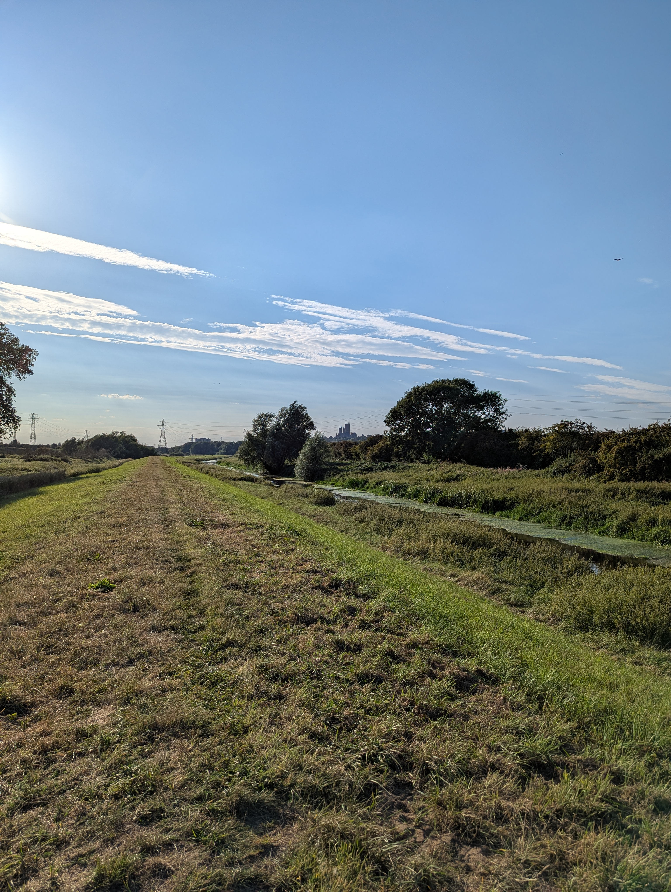{#fig-lin-dike fig-alt="View from the dike on the River Witham with Lincoln Cathedral on the horizon. Lots of swallows were feeding."}

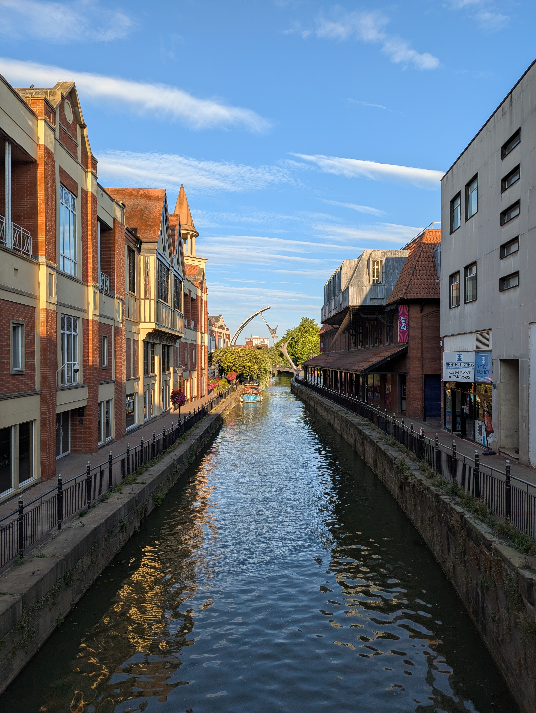{#fig-lin-river-centre fig-alt="View along the River Witham in the centre of Lincoln."}

I walked back into town and down to the marina and got some food from Wagamama for dinner.

## Day 6: Peterborough

Train Lincoln (LCN) 1002 -\> Peterborough (PBO) 1127 £16.60

I'll get the grumbling out of the way first again. Today was my first day of public transport snafu, but only a minor delay and a very crowded train. I'm actually surprised nothing has gone wrong earlier. However, my boss being from East Anglia, had made some fairly negative comments about Peterborough and I was primed for it to be a bit grotty. And yes, I'm afraid there's not much to recommend it as city. It was my least friendly arrival too, as the guy in the hotel tried to charge me for leaving my bag, and when I challenged him about that given that the website says all Premier Inns have free baggage storage, he admitted it was a voluntary charity donation. Cheeky git.

As with previous cities, the level of deprivation is high and I was slightly taken aback about the openness of the drug dealing and alcohol abuse. Several people slumped in doorways or on benches and groups of men shouting at each other. There were several community officer people near the cathedral, but I ended up eating my lunch in the shopping centre as it felt like I was least likely to get any grief in there. There is obviously wealth in the area, as I saw lots of flashy cars on the ring road and there's a huge Waitrose right by the station, but the centre is more run down than Southampton. Which is sad as I learnt later, it used to have a lot wealth from railways and engineering.

I'm just putting here for the record as I've said it many times, but never written it down, I'm one of those people who thinks many of the problems we're experiencing in the world now go back to 2008 and the financial crisis. And likewise I think it will be mid 2030s before we really understand the effects of the pandemic. And whilst I think things are fixable, the UK is poor and run down, and that's apparent on this trip. Just as it's been apparent seeing close up how the social care system and NHS is ~~fucked~~ working in the last 7 years.

However, in the middle of it all, slightly tucked away is the impressive [Peterborough cathedral](https://peterborough-cathedral.org.uk/). I did the highlights tour, a full 90 minutes with a retired Maths teacher who I'm going to call Pam (apologies if I got that wrong) which was very good. Another cathedral on a site where there has been religious structures for over 1000 years. As usual it's been built and re-built and changed throughout it's history. Most recently following attempted arson in 2001 which nearly destroyed it.

[Wikipedia](https://en.wikipedia.org/wiki/Peterborough_Cathedral) has all the history, but here's the highlights I got from the tour: it was a statement of Norman power and has many of the Romanesque round arches that are associated with the Norman's, but what I learnt today was that the Norman's probably learnt their masonry skills from Islamic culture either by enslaving or employing them. This was inferred from some of the patterns they painted on the masonry that is seen across churches and cathedrals in Europe. Most of these were removed in England because of Cromwell (I think it was him and not the Reformation) and I meant to go back and take a picture of a bit that remained in Peterborough, but forgot. So as well as incorporating/eliminating the pagan gods by forcing the Saxons to become Catholic Christians, they drove out the Jews and the Muslims, but took what they liked from those cultures too. And then Henry VIII destroyed what was the medieval social services (the monks) by deciding he wanted to change his wife and breaking with Rome. And then Cromwell smashed everything up before the Restoration. My not so subtle point being that I've learnt a lot about the powerful ruining the lives of Joe Average in the past, plus ça change.

As it developed over the centuries they started using the newer more fashionable pointed Gothic arches which are also stronger. So the western entrance has Gothic arches and for reasons no-one knows, uniquely the actual entrance arch is smaller than the the two either side.

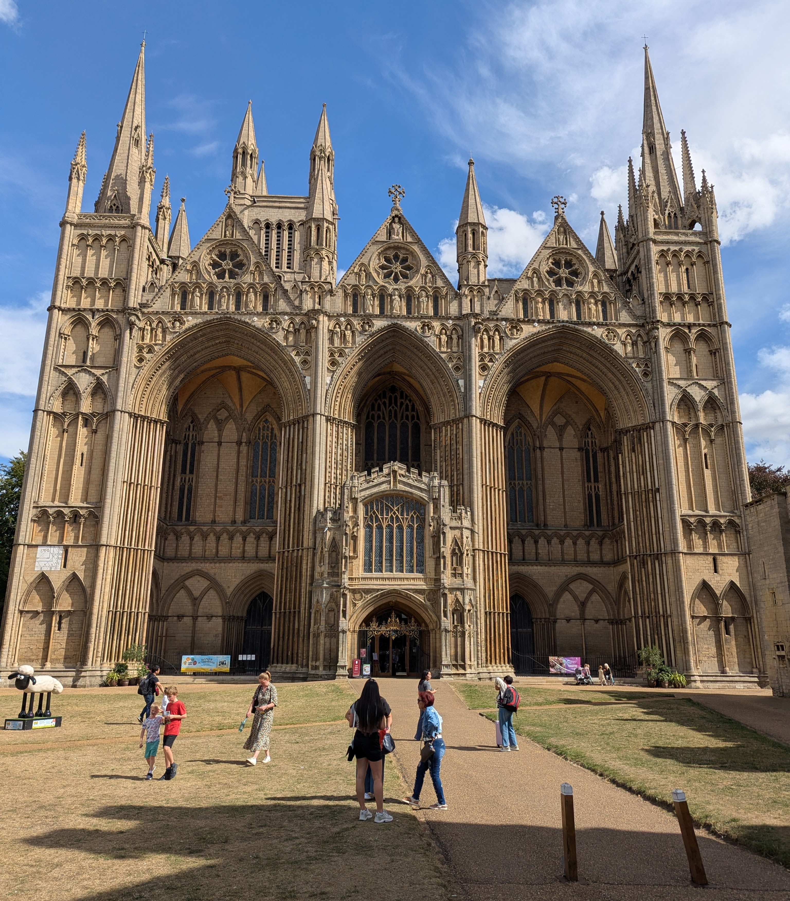{#fig-pet-cath fig-alt="Western entrance to Peterborough cathedral. Uniquely the middle arch is smaller than the outer two."}

Also unique is the size of painted wooden roof in the nave (@fig-pet-roof) , and there is no screen in front of the choir, and you can see all the way to the eastern high altar (@fig-pet-roof). There was, but no longer.

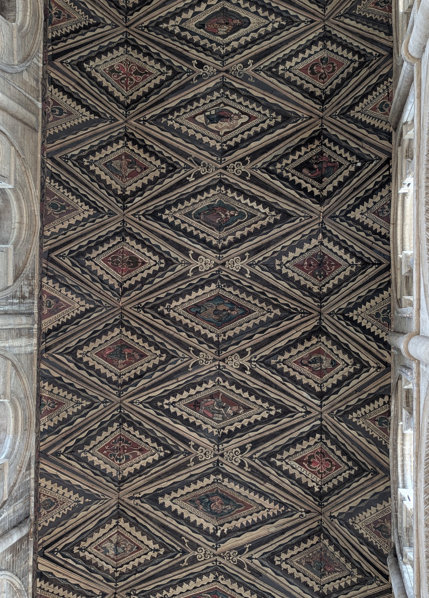{#fig-pet-roof fig-alt="Painted wooden roof in Peterborough cathedral."}

{#fig-pet-nave fig-alt="The nave with no choir screen in Peterborough cathedral."}

In the eastern end they have the oldest bit of religious masonry called the Hedda stone (@fig-pet-hedda) from when it was an Anglo-Saxon church and some very nice fan vaulting similar to that in the cloister at Gloucester (@fig-pet-fan).

{#fig-pet-hedda fig-alt="Hedda stone in Peterborough cathedral."}

{#fig-pet-fan fig-alt="Fan vaulting in Peterborough cathedral."}

As most people couldn't read or write in medieval times, cathedrals have a lot of graffiti carved into the stone, which was a way for desperate people to ask God directly for help. I remembered to take a picture of one piece today.

{#fig-pet-cross fig-alt="Graffitti in the shape of a cross in Peterborough cathedral. Believed to be a direct request for help to God by someone who couldn't write."}

Outside the cathedral they found some 12th century stone coffins during renovations believed to be for important monks or dignitaries.

::: {#fig-pet-coff layout-ncol="2"}
{#fig-pet-c1 fig-alt="Two stone coffins without lids." width="100%"}

{#fig-pet-c2 fig-alt="Two stone coffins with lids."}

12th century stone coffins at Peterborough cathedral
:::

After visiting the cathedral and a cup of tea, I went for a walk along the River Nene out onto the Fens in the early evening sunshine. I realised when I was walking back that you can see the cathedral from there and I wondered if that's how pilgram's would have approached it (@fig-pet-nene) .

{#fig-pet-walk fig-alt="River Nene walk route."}

{#fig-pet-nene fig-alt="Peterborough cathedral from the bank of the River Nene."}

Here's a couple of other pictures from my walk.

{#fig-pet-along fig-alt="Along the River Nene."}

{#fig-pet-bridge fig-alt="Some concrete bridge piers on the River Nene. I love a bit of concrete in the sunlight."}

As my Premier Inn is opposite Domino's, that was dinner tonight and lunch tomorrow. I've not had a Domino's in years (a decade?) and it hasn't changed or improved! Lip-gloss pizza.

## Day 7: Ely

Train Peterborough (PBO) 0843 -\> Littleport (LTP) 1003 10km walk from Littleport to Ely \| Ely (ELY) 1415 -\> Peterborough (PBO) 1449 £18.30 \| Peterborough (PBO) 1911 -\> Southampton (SOU) 2222 £47.30

I woke up at 0530 on Day 7 ready to go home. But there was still one more cathedral left to visit, so I headed down to catch the train to Littleport and then walk back to Ely along the River Ouse (@fig-ely-walk). It's a nice ride across the Fens and I had a 25 minute change at Ely, so I sat and had a coffee on the station, which as stations go was a nice place to sit in the sunshine.

{#fig-ely-walk fig-alt="10 km walk from Littleport to Ely along the River Ouse." width="50%"}

The walk itself is one of those footpaths at the start which goes through people's gardens, which is always weird and I feel like I'm doing something wrong. And then it's out onto the river bank for several miles. It's very exposed and the wind was blowing across the Fens. I was actually glad it clouded up so I didn't get too hot or burnt.

::: {#fig-ely-river layout-ncol="2"}
{#fig-ely-w1 fig-alt="Sign for the Black Fen Trail." width="30%"}

{#fig-ely-w2 fig-alt="View over the Fens and River Ouse" width="70%"}

Walk along the River Ouse to Ely cathedral.
:::

There were cattle and you can see the cathedral from about 5 miles away getting closer all the time. One has to try at imagine how it must have been the biggest building for most of it's existence and a beacon for pilgrims. There's a short, not very nice road section and then one crosses a rickety bridge into a wildlife reserve and into the city. There was my first brief shower of the trip, I've been very lucky with the weather, and then the sun came back out and as I came around the corner the cathedral reappeared.

{#fig-ely-cath-1 fig-alt="Ely cathedral as I entered the city."}

[Ely cathedral](https://www.elycathedral.org/) is another Norman/Gothic combination, built upon the site of an old Saxon Abbey, which seems to be the way with English cathedrals. It's main point of difference being all these octagonal towers and the big lantern tower in the middle. [Wikipedia](https://en.wikipedia.org/wiki/Ely_Cathedral) has all the details of course.

{#fig-ely-cath-front fig-alt="The western entrance to Ely cathedral."}

After I arrived I sat outside and finished the rest of my pizza before heading inside to discover my timing had meant I was between main tours and the Octagon Tower tour was fully booked. To be honest, I was a little relieved as I was feeling like I'd had enough and instead spent an hour exploring and taking pictures of things I'd learnt about elsewhere, but not included here previously.

For example, one of the first things I learnt at Gloucester was that all the columns would have been plastered and painted, but Cromwell being a puritan had all everything whitewashed and the the plaster got removed by the Victorians. What this means is that you can often see the masons marks. These are the marks unique to each mason that indicates they carved that stone, and they got paid by the stone. They could read or write, so this was they made sure they got paid. They are only visible because the plaster has been removed (@fig-ely-mason).

::: {#fig-ely-mason layout-ncol="2"}
{#fig-ely-m1 fig-alt="A masons mark on a column" width="100%"}

{#fig-ely-m2 fig-alt="A masons mark on a column"}

Masons marks on columns in Ely cathedral. They got paid for each stone carved and this was how they made sure they got paid. Originally these columns were plastered and decorated and the marks invisible.
:::

Another thing I learnt about what Cromwell did, was smash a lot things up. So all the cathedrals have damage often literally from swords or axes where things have been struck or removed, so I took a couple of photos at Ely showing where statues are missing or stonework has been defaced (@fig-ely-damage).

::: {#fig-ely-damage layout-ncol="2"}
{#fig-ely-d1 fig-alt="An empty statue nook." width="100%"}

{#fig-ely-d2 fig-alt="Missing statues and damage in the chantry chapel"}

Missing statues and damage caused by Oliver Cromwell at Ely cathedral.
:::

And I found some remaining ceiling decoration of what I think is the Islamic style that I learnt about in Peterborough that suggests some of the masons came from or were influenced by Islamic culture and incorporated into Norman Christian design (@fig-ely-islam).

{#fig-ely-islam fig-alt="Possible Islamic style ceiling decoration in Ely cathedral."}

The big unique feature is the [Octagon lantern](https://en.wikipedia.org/wiki/Ely_Cathedral#Octagon). It's a tower with a complex wooden structure and decorated panelling. The whole area floods with light.

::: {#fig-ely-octagon layout-ncol="2"}
{#fig-ely-o1 fig-alt="Octagon Lantern Tower from the outside" width="100%"}

{#fig-ely-o2 fig-alt="Octagon Lantern Tower from the inside."}

Octagon Lantern Tower at Ely cathedral.
:::

Here's two pictures of the nave.

{#fig-ely-nave fig-alt="Ely nave with it's painted wooden ceiling facing towards the choir and eastern high altar."}

{#fig-ely-nave-2 fig-alt="The nave facing toward the western entrance at Ely cathedral."}

I didn't really fancy exploring the city, sorry Ely. So I went at got the train back to Peterborough and had a nap for an hour before writing this up. Even though I've paid for the hotel tonight, I decided to get the train home and sleep in my own bed rather than use half a day travelling tomorrow.

So that's it. 7 cathedrals in 7 days.

## Epilogue

To be completed.

## Planned Itinerary {#sec-plan}

Thu 2025-08-21 to Thu 2025-08-28 (Went home on the evening of Wed 2025-08-27

### Days and train travel

1.  Gloucester Thu 21 SOU 0911 -\> GCR 1156 (SOU \> BRI £25 \> £12.20 GCR £37.20)
2.  Worcester Fri 22 GCR 0854 -\> WOF 0947
3.  Coventry Sat 23 WOF 0924 -\> COV 1042
4.  Leicester Sun 24 **Bus** Arriva X6 1015 1120 £3
5.  Lincoln Mon 25 LEI 0944 -\> LCN 1131 £16.30
6.  Peterborough Tue 26 LCN 1002 -\> PBO 1127 £16.60
7.  Ely Wed 27 PBO 0843 -\> LTP 1003 10km walk from Littleport \| ELY 1715 -\> PBO 1751 \| PBO 1930 -\> SOU 2242 £47.30
8.  ~~Peterborough to Southampton Thu 28: PBO 1050 -\> SOU 1349 £52.80 or Wed 28 PBO 1930 -\> SOU 2242 £45.70~~

### Cathedral tour times and costs {#sec-tours}

1.  Gloucester: 2pm and 3pm £8
2.  Worcester: 11am or 2.30pm £8
3.  Coventry: Self-guided
4.  Leicester: Open 1200-1500 Sundays. No tours.
5.  Lincoln: Floor tour all day incl, admission, Roof Tour 1pm £7.50
6.  Peterborough: Tour 1430 £6.50, book in advance.
7.  Ely: Octagon Tower 1400/1515 £12, General Tour free incl. admission 1400.

### Premier Inns {#sec-hotels}

Premier Plus rooms except Lincoln, which have fast WiFi and a fridge. Non-flex rates: non-refundable.

1.  Gloucester £117
2.  Worcester £136
3.  Coventry £136 (£121 plus early check-in £15)
4.  Leicester: £49
5.  Lincoln : £52 Standard
6.  Peterborough £210 for 2 nights
7.  Peterborough

Total: £705

### Side missions {#sec-side-missions}

-   Gloucester: National Waterways Museum.
-   Worcester: Cricket 1100 - 1900: £10
-   Coventry vs QPR on Saturday at 1500: £32
-   Leicester: National Space Centre. Abbey Pumping Station.
-   Lincoln: Castle
-   Peterborough: Cinema? Museum

### Food & drink ideas {#sec-food}

-   Gloucester: Soul n' Seoul (food), Gloucester Brewery \@ Warehouse4 (pub)
-   Worcester : Wayland's Yard, Francini Cafe (coffee), The Dragon Inn (pub), Maneki Ramen (food)
-   Leicester : Udupi Shivalli, Kayal (food)

### Insurance {#sec-insurance}

Admiral for 10 days in the UK: £7.01. I bought for longer than I'm away in case I needed to cancel before I departed.
