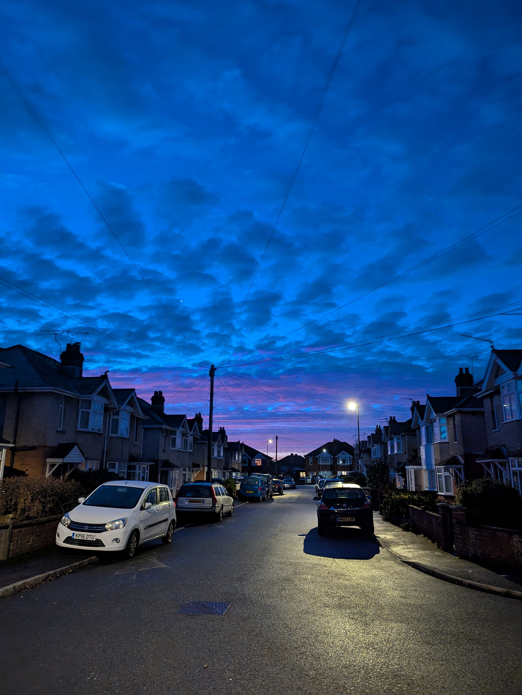
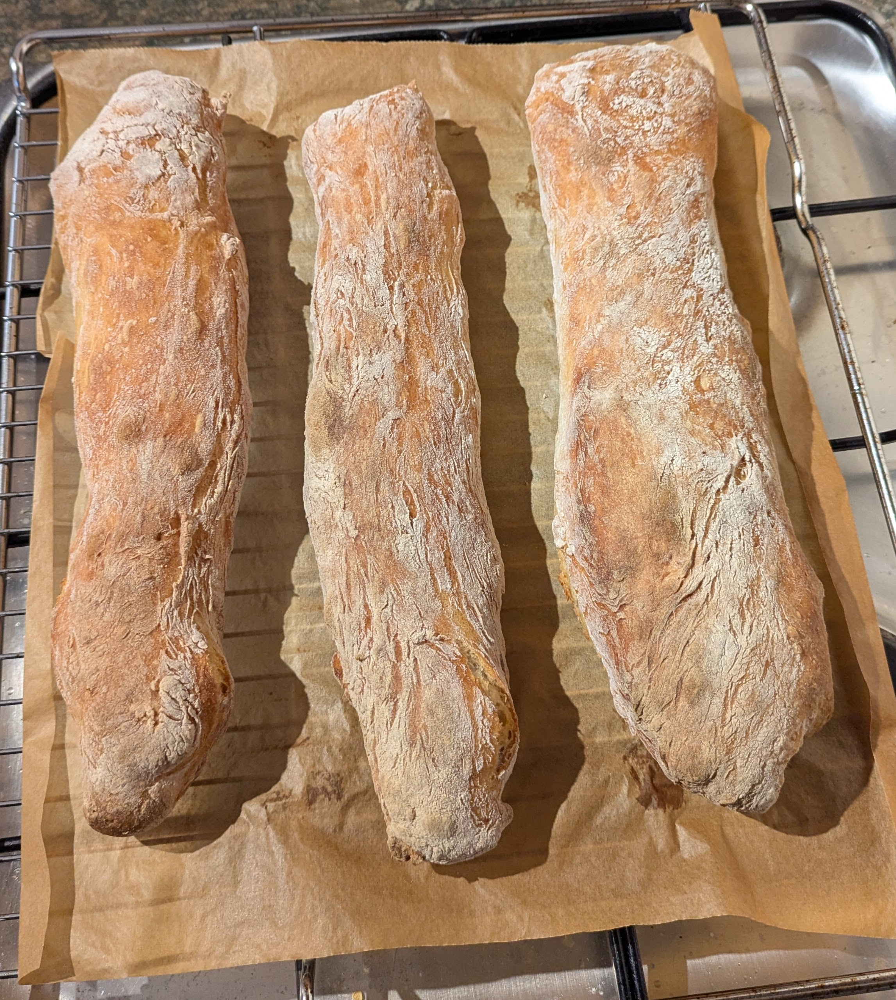
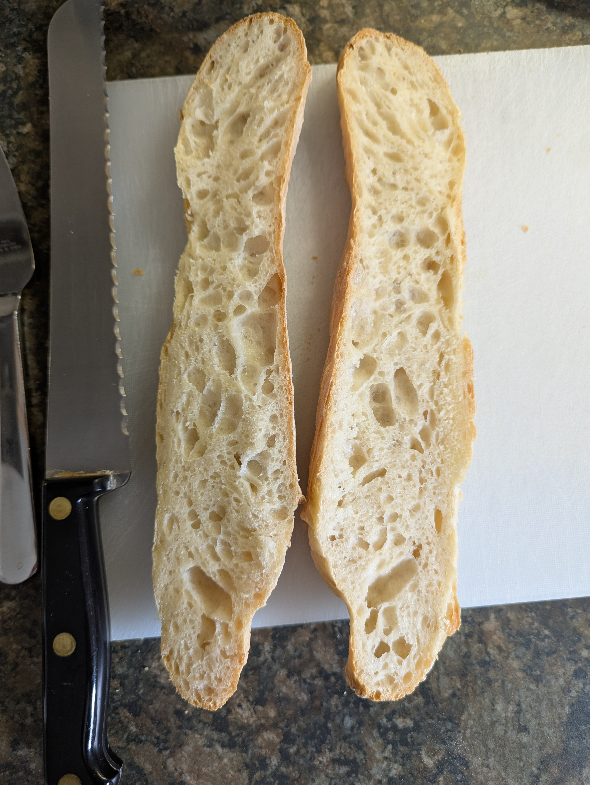

{#fig-sunset fig-alt="A photo the sunset in Southampton on 16th December 2025. It shows a road with parked cars and terraced houses and blue/violet sky with traces of clouds, oranges and pinks." width="500"}

## Prologue {#sec-prologue}

I've never been very good at keeping diaries etc. in any sort of systematic way, and this blog is no exception. But in keeping with Simon Willison's philosophy of *“I just figured this out: here are my notes, you may find them useful too”*, albeit much more verbose along with my thoughts and feelings, here's a three things I learnt/achieved in the last quarter of 2025:

-   @sec-exercise : Exercise

-   @sec-brewing : Brewing Beer

-   @sec-baking : Baking Bread

Exercise and Brewing are also both about cutting down on drinking and using LLMs as research and planning tools.

**TL:DR:** I started running again 3 times a week and went from 0 to half-marathon distance in 13 weeks. At the same time I reduced my drinking to two beers on Wednesday, Saturday and Sunday. I brewed beer for the first time. And I learnt a great quick recipe for making all my lunch bread.

## Exercise {#sec-exercise}

This is what I wrote at the end of August:

**2025-08-31**

*'There are 17 weeks left in the year and I would like to get some fitness back again. I began running again in 2024 after a two year hiatus and got back to being able to run half-marathon distance comfortably. I then got ill right at the start of 2025 including New Year and have never really recovered. I think it's viral, possibly was COVID, but I didn't test positive. The residual symptoms are catarrh and Benign paroxysmal positional vertigo (BPPV). I'm generally tired, but I can't distinguish between getting old, burn-out and any viral effects.*

*So the plan is to try and get back to running half marathon distance and ideally enough upper body strength to able to do one pull-up (with a view to more!) by the end of the year. I haven't been able to do a pull-up since the pandemic.*

*But frankly any improvement and ability to stick to a routine would be good.*

*I'm going to stop drinking for a bit too. No idea how long that will last, but I'm not very good at sticking to one or two days a week. If I drink on one day, then I'm likely to drink on the next. And I'm not sure what the health risk for me of 4 or 5 units (two beers) most days is, but probably not ideal. That's traded off against the fact that I like the taste of beer and that it helps me switch off. There are no solutions, only trade-offs. But I shall try the trade-off of sobriety in helping me exercise for a while.*

*I did a 'Jog 1 minute then walk 1 minute for a total of 30 minutes' today to see how I was. This is the lowest level and it was the right place to start. Likewise my strength work will start at the lowest level. I know from prior experience that building a habit takes many weeks and overcoming reluctance to [stick to the plan](https://www.tiktok.com/@nocontext_football/video/7326290318020660513). That will be true for both exercise and not drinking.'*

After the first week I decided that trying to do strength work at the gym and a running schedule was too much on top of everything else. Running is minimal cost and equipment, so I chose to do that with a view to adding some strength work in 2026 if things worked out. I also decided to not drink at all for the first month (September) and then review in October. More about that in the brewing section.

My base fitness before starting this programme is that I average around 10 km/6 miles walking a day, with my long walks up to around 22.5 km/14 miles.

### Return to run plan {#sec-return-to-running}

Weeks 1 to 4 are taken from [Oxford's NHS Return to Running Programme](https://www.ouh.nhs.uk/media/tinj0s3i/86729running.pdf) and then I am using runs based on Jeff Galloway's programmes and his walk/run method.

-   Week 1: Jog 1 minute then walk 1 minute for a total of 30 minutes. Repeat three times per week.
-   Week 2: Jog 2 minutes then walk 1 minute for a total of 30 minutes. Repeat three times per week.
-   Week 3: Jog 4 minutes then walk 1 minute for a total of 30 minutes. Repeat three times per week.
-   Week 4: Jog 9 minutes then walk 1 minute for a total of 30 minutes. Repeat three times per week.
-   Week 5 onwards: Twice a week 4 x 1 mile reps (40 minutes) and one long run starting at 10km (6 miles) and building to 21 km (13 miles).

Optional Park Run week instead of long run.

### Up to half-marathon distance {#sec-half-marathon}

From Week 5 and before the clocks changed I was doing two evening runs of 4 x 1 mile reps, and then in November I switched to running to and from work twice a week. It's 4.3 km each way i.e. 8.6 km/day. The downside of run commuting is logistical: carrying clothes and food, keeping a towel and shower stuff at work etc. But the upside is mostly running in the daylight and building the exercise into my day instead of it being something I do in addition to everything else.

I did a total of 3 runs a week, mostly I did my long/other runs on the weekend following my old Jeff Galloway training programme which means I walk for one minute after every 10 minutes or so of running. I've been doing walk-runs for over 20 years and it works for me.

-   Week 6: 11.3 km/7 miles

-   Week 7: 12.9 km/8 miles

-   Week 8: 14.5 km/9 miles

-   Week 9: 16 km/10 miles

-   Week 10: 5 km (Park Run)

-   Week 11: 19.3 km/12 miles

-   Week 12: 4 x 1 mile reps

-   Week 13: 21.3km/13.1 miles (2025-11-28)

### Shoes and gear {#sec-run-gear}

At the start of 2024 I bought a [Garmin Forerunner 55](https://www.garmin.com/en-GB/p/741137/) for £139. It's not especially user friendly, but with the app on my phone it does everything I need: does vibrate/silent notifications for my phone, counts steps/GPS for distance, I can programme workouts with intervals, it plots my routes on the map, monitors my heart rate (which is a great proxy for effort level and fitness) and can track my shoe usage. It also tracks sleep, calories and breathing, but those are probably not accurate. It needs charging once or twice a week.

I tend to have two pairs of shoes on the go at any one time and alternate them as one pair for short runs and one for long runs. From experience I do tend to get rid of them after about 800 km/500 miles of use. I used to wear shoes until they fell apart, but after developing knee pain that went away when I got new shoes, I just decided to accept the cost of replacing my shoes every few months. My price limit is currently around £80 for shoes. I always buy previous years models and have no loyalty to brand. My old shoes go in the local shoe recycler. As I buy everything on-line, my go-to site for checking out shoes before buying is [Run Repeat](https://runrepeat.com/).

Clothes wise I just buy wickable running clothes and accept getting wet as better than getting too hot in waterproofs. Leggings in the winter and shorts in the summer. No particular brand, just whatever is on offer and least hideous.

For long runs and anytime I need a bag, back in 2018 I was tipped to buy what I considered an outrageously expensive running bag/vest by a former Marine, the [Salomon ADV SKIN 12](https://www.salomon.com/en-gb/product/adv-skin-12-lc13267). It was £83 then, now £140, but it turned out to be a great purchase. It's starting to show signs of wear and tear now, and maybe cheap copies are just as good now, but it's served me well and once one figures out how to pack it, it can hold a surprisingly large amount of stuff.

I do also own some Lek running poles, but I've only ever used them for walking. They are super helpful for not falling over or navigating really muddy or wet bits. My understanding for running is that they additionally help take pressure off your knees on hills.

### Health effects and how I feel/felt {#sec-run-health}

At the start of September my average resting heart rate whilst sleeping was 52 bpm and by the start of December the lowest recording was 44 bpm and the average was 46 bpm. So that's over 10% fall. I've lost weight - although I don't weigh myself, so I don't know how much - this is just based on my trousers getting looser and is probably also down to cutting down drinking. And my whole body has changed shape in response to running too. And general aches and pains have declined.

Mentally this has been hard. Really hard. Most days I don't want to do it, and I'm not really enjoying it when I do it. One of my mantras when I'm running is "I'm choosing to do this" but quite a lot of the time I'm just swearing at myself. Afterwards, particularly on a long or intense run, I'll get the endorphin pay off - which basically means I feel very calm for a while, possibly a couple of hours. This doesn't always happen and can easily be curtailed/prevented by an incident such as someone hurling abuse at me or seeing the news.

It's always slightly surprising to me when I achieve what I set out to do. Failure is the norm. As usual I'd say luck played a huge part: there were no crises to upset my routine. The rest was having a decent plan, experience and process to follow.

## Brewing Beer {#sec-brewing}

{#fig-beer fig-alt="A picture of a glass of amber coloured beer with a white foamy head on a side table with a light behind the beer bottle next to it. " width="500"}

This is as much about my relationship with alcohol as learning to brew, and is connected to my exercise plan. It's also related to my coffee making. And chatting with Claude (Large Language Model).

As I wrote in August (@sec-exercise) my relationship with alcohol is that I don't like drinking more than two beers (4-5 units) of an evening, but that if I drink one day, I very much want to drink the next day. And although I've gone whole years e.g. 2019, without drinking at all, equally there are months (such as in 2025) where I've drunk every day. I like the taste of beer and I like the numbing effect of alcohol. I have very busy mind (if you mention mindfulness then I will get quite cross) and alcohol (in addition to intense exercise) is one of the few things that quietens my mind down. So I only drink in the evening generally as it helps me get to sleep. And I remember listening to an episode of Say Why To Drugs - think it was this one about [Dry January](https://shows.acast.com/saywhytodrugs/episodes/dryjanuary) - where they discussed the issue of drinking in moderation versus total abstinence. The former being harder for many people (including me with respect to frequency) than the latter, but there not being much research into that. At the same time as I was in the first month of my exercise plan I had a chat with Claude about resting heart rate changes and the effects of alcohol and exercise on my heart. Claude suggested I tried sticking to 3 days drinking a week instead of abstinence - arguing this would be a good compromise in terms of health benefits whilst still being able to enjoy beer. It also prompted thoughts about what it is about beer that I like compared with other drinks beyond the effect of the alcohol.

I watch a lot of YouTube these days, and one evening in September during my month of not drinking the algorithm suggested a video where the young YouTuber learnt to brew beer at home (@sec-youtube). I think this was because I watch a lot of camping and coffee making content and there was overlap with his content. And I found watching brewing content whilst being dry myself quite comforting. I've previously spent more than a small amount of time learning about coffee making, and so this felt interesting to me in the same way: moving me towards quality rather than quantity, thinking about what I like and why I like it and feeding my busy mind and my need to know how things work.

When October came around, I decided to try a month of drinking on Wednesdays, Saturdays and Sundays only. I chose these days as it gave me something to look forward to mid-week and I usually drive/train to Devon on Saturday to my Dad's care home, so I don't drink on a Friday. It also meant that by never drinking more that two days in a row, I hopefully wouldn't build too much psychological/physical cravings and miss it during the days off. Through YouTube, other reading and subsequent reflections on what I like about beer, I decided to brew some beer too.

Modern beer is essentially a drink fermented from a sweet base that is flavoured with bitterness from hops and from flavours produced by the yeast in conjunction with the water chemistry. Modern food technology means that brewing can be done with fine control and all sorts of flavours can be produced. It's also notable - depending on your definition of old - that most beer we drink today doesn't really have a heritage beyond 150 years. Older than say Italian cuisine, most of which is no older than WW2, but 150 years feels recent to me!

Bitterness is supposedly the last flavour we come to like due to poisonous foods being bitter. Coffee being another good example of an addictive bitter substance humans have come to love. Beer ranges from low bitterness beer such as wheat beers to high bitterness beers such as Indian Pale Ales. I like most beers I've tried, but there is a reason the most popular things are popular and why I find it snobbish and bizarre that vanilla would be used as a pejorative term. Hence as an average human, I realised I have average tastes and my two favourite beer styles are Pilsner Lagers and West Coast IPAs. Everyone knows lager, but if you don't know West Coast IPAs, they are highly bitter with quite a lot of grapefruit and citrus type flavours.

Brewing Pilsner requires being able to control the temperature. I live in a flat with limited space and on a limited budget, so I went with brewing a West Coast IPA using a kit and an investment of about £175 (@tbl-brew-gear). I got most things from [The Malt Miller](https://www.themaltmiller.co.uk/).

The Mangrove Jacks Craft Series Beer Kit - [American IPA with Dry Hops](https://mangrovejacks.com/products/american-ipa-with-dry-hops) brews up to 23L of beer, that's 46 x 500mL bottles. Part of the motivation was also to be able to give some beer away, but with hindsight even the 39 bottles I brewed seems like too much. Especially as I am trying to cut down!

This means each bottle worked out about £4.50, but as most of the things I bought are re-usable, future batches would be less than £1 per bottle for the same beer. So if saving money was a priority, then home brewing pays off after multiple brews if you don't end up down the rabbit hole of buying thousands of pounds worth of equipment.

The other thing I had to do for this beer, and another reason it was a good choice for where I live, is optimise the water chemistry having downloaded the water quality report from Southern Water. That's why the table below contains gypsum, citric acid and campden tablets. As with coffee and tea, much of the flavour comes from what's in the water and can really change the way it tastes for better or worse. Pilsner needs soft water, but West Coast IPA works quite well with hard water with a few tweaks.

The beer turned out really well (@fig-beer), one colleague actually tasted it side by side with Sierra Nevada and said he thought the kit tasted better. If it did I suspect that it is in part due to freshness, which is something else I've learnt about why one beer can taste better than another.

Being a kit means that that malt base has already been made as a liquid extract that one dilutes with water and then ferments with the yeast and hops. The next level is to buy malt grains (partially germinated grain) and create the extract (wort) oneself, but it requires more gear and more investment. It took a month from start to finish: two weeks brewing in the plastic bucket fermenter and two weeks conditioning/carbonating in the bottles.

In October whilst the beer was brewing I did try and stuck to drinking 3 days a week as described and have continued that now for nearly 3 months. It feels much more balanced to drink less often, but better. It was/is more difficult than total abstinence, I assume due to addictive nature of alcohol and my relationship with it as something to numb my mind, but hopefully like all habits, it becomes easier to maintain the longer I do it. In learning about beer and beer types I find I'm drinking a wider variety of beer types (another reason for not brewing large batches) and making more effort to taste the beer when I drink it. With food and drink generally I'm not very mindful. It often feels like a chore or just fuelling up, so it's helpful to slow down and think about it a bit.

My current favourite beers in are [Utopian Lagers](https://www.utopianbrewing.com/), [Chimay Triple (White)](https://chimay.com/en/beers/chimay-triple/) and [Five Points Best Bitter](https://fivepointsbrewing.co.uk/collections/beer/products/five-points-best-bottles).

| Item | Cost (GBP) | Supplier |
|:------------------------------------|------------------|------------------|
| Mangrove Jacks Craft Series Beer Kit - American IPA with Dry Hops | 26.65 | Malt Miller |
| Mangrove Jacks Liquid Malt Extract 1.2kg | 8.95 | Malt Miller |
| 30 Litre TMM Fermenter with fitted tap and airlock | 20 | Malt Miller |
| Hydrometer | 5.5 | Malt Miller |
| Stick on Thermometer | 1.99 | Malt Miller |
| Chemclean 400g and Chemsan No Rinse Sanitiser 100ml Pack | 11 | Malt Miller |
| Bottling stick | 3.15 | Malt Miller |
| Amber PET bottles (24) | 12.95 | Malt Miller |
| Amber PET bottles (24) | 12.95 | Malt Miller |
| Plastic Spoon | 1.4 | Malt Miller |
| Citric Acid 100g | 1.95 | Malt Miller |
| Gypsum | 4.8 | Malt Miller |
| Campden tablets 0.5g x 50 | 4.59 | Amazon |
| 25L Jerry Can | 10.49 | Amazon |
| 7.5L bowl | 2.5 | Local shop |
| Small funnel | 1.5 | Local shop |
| Bottle tree | 16.99 | Amazon |
| Bottle rinser | 15.5 | Amazon |
| 1 m Platinum Cured Silicone Tubing 12mm ID 21mm OD | 11.1 | Malt Miller |

: Brewing Gear List for my first brew of a West Coast IPA {#tbl-brew-gear}

### Brewing YouTubers {#sec-youtube}

The video that got me started was one by [Just Alex](https://youtu.be/ENu9rj1Ucl0), but all the others I've watch have been by [The Malt Miller](https://www.youtube.com/@themaltmiller8438), [Brulosophy](https://www.youtube.com/@TheBrulosophyShow), [HomeBrew Challenge](https://www.youtube.com/@TheHomebrewChallenge), [The Apartment Brewer](https://www.youtube.com/@TheApartmentBrewer) and the [Craft Beer Channel](https://www.youtube.com/@TheCraftBeerChannel).

One of the things I learnt from YouTube is that I am demographically exactly what one would expect from a home brewer: a white, middle-aged man. But that I've started a declining hobby. Home brewing took off in the 1970s, but that cohort of brewers are ageing out and a combination of the internet, many more choices for young people and various other factors means that homebrew shops and clubs are in decline.

I am not sure whether I want to continue brewing or not in 2026, but I did learn a lot about beer and brewing and drinking in moderation from this experience. Perhaps the latter being the most important lesson.

## Baking Bread {#sec-baking}

Another serving from the YouTube algorithm was from a channel with just one video! But it's a very good video about baking [the 5 minute baguette](https://youtu.be/Z-husjZkxHw).

I take coffee and lunch with me to work every day - partly to save money, but also cos I think the food and drink I make is often better than what I can buy. This video which I tweaked the recipe to make 3 baguettes that I cut in half to freeze, giving me 6 lunches is perfect for me. 30 seconds in the microwave in the morning defrosts one enough to make lunch with. Fresh bread and much better than the part-baked baguettes from the supermarket I used to eat (@fig-bread, @fig-baguette-2).

I prepare the dough in 5 minutes as advertised the night before. Bake in the morning. And then freeze. Or you can prepare in the morning and bake in the evening.

My slightly smaller than the original recipe:

-   750g Strong White Bread Flour

-   2.5g Yeast (I use the 7g sachets and freeze them between uses)

-   7.5g salt (you can use much less, but I'm not too worried about my salt intake)

-   550 mL of water (I usually use the scales and pour until I've weighed 550g of water)

Mix it up until it's combined. Seal the bowl (I have one with a lid). Leave on the side overnight.

Next morning/evening: Remove the a rack and place baking paper on it. Put the oven onto 250C. Cover a board with flour and gently tip the dough out using a spatula. Then use a spatula to divide the dough into three. Cover your hands with flour and roughly shape them into baguettes. Put them on the rack and bake for 25 minutes.

It's a bit messy, but my tip would be use a little flour to help you clean your hands and the bowl. I would probably say I'm more like 10 minutes work than 5, including cleaning up, but it is still low effort for the reward.

{#fig-bread fig-alt="Three lovely fresh baguettes on a rack fresh out of the oven." width="500"}

{#fig-baguette-2 fig-alt="The inside of a fresh baguette with many holes in the fluffy white dough." width="500"}
